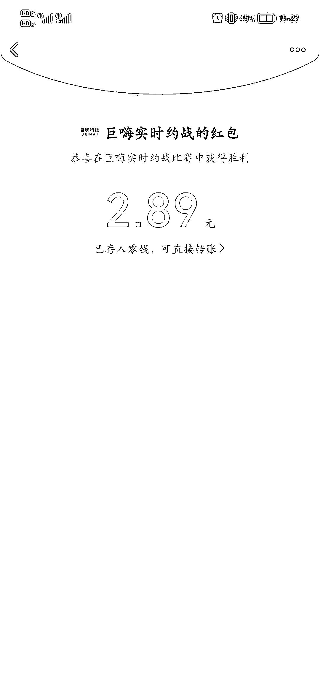
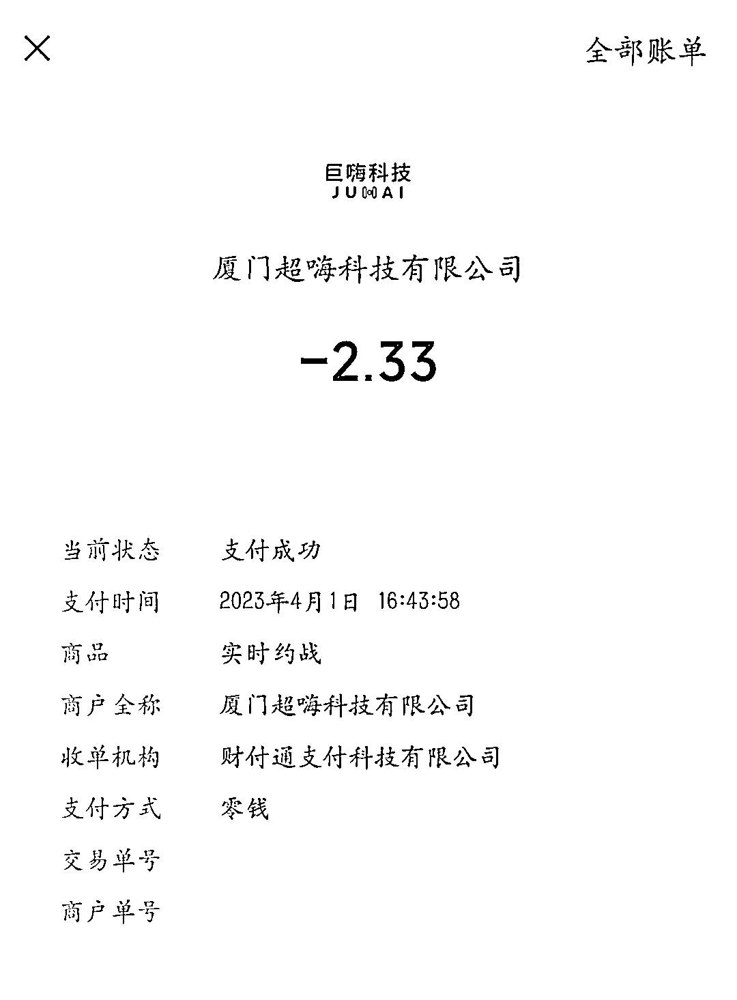

# KTV 联网交 2.33 元的“入场券”挑战，赢的一方可以获得奖金

> 原文：[`www.yuque.com/for_lazy/xkrm14/ooywrw28s1iqigmi`](https://www.yuque.com/for_lazy/xkrm14/ooywrw28s1iqigmi)

作者： 明月几时有

日期：2023-04-11

点赞数：48

正文：

KTV 联网，去唱歌的人可以发起挑战，每挑战一首歌需要交 2.33 元的“入场券”，赢了的一方可以获得大于 2.33 元的现金红包，最高可获得 99 元（概率很小，但是可以吸引人，一般都是给小于 3 块的红包）。 每次挑战都必须有两个人才能开启，也就是说，一次挑战系统可以收 4.66 元的入场券，赢的一方系统返还 3 元左右。不管哪方赢，系统都能赚一块多。

  

  

  

评论区：

一个人看夕阳 : 这个怎么操作

明月几时有 : 我是消费者

Luke 王子 : 赌场套路学到家了 庄家必赢

