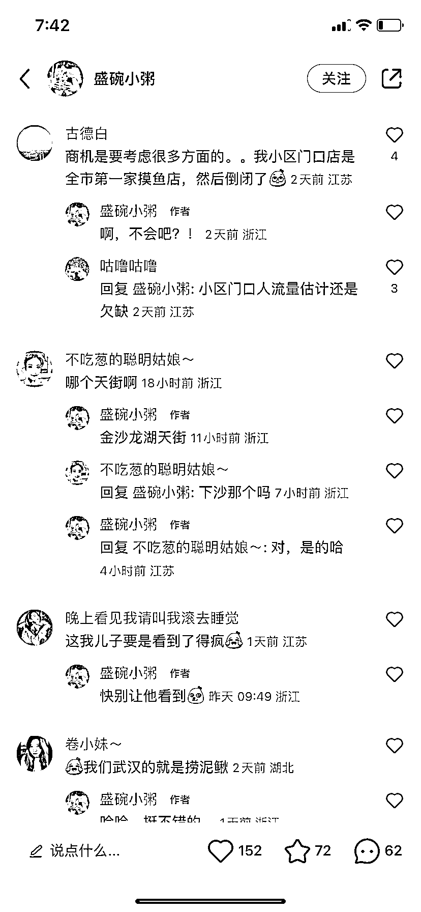

# 捞鱼项目很适合在各大城市的商城里做

> 原文：[`www.yuque.com/for_lazy/xkrm14/ighcy16gfm0qam1b`](https://www.yuque.com/for_lazy/xkrm14/ighcy16gfm0qam1b)

作者： 我安了个安安

日期：2023-04-10

点赞数：19

正文：

商场捞鱼的项目，很适合在商场之类的地方做，比较适合城市，让孩子感受大自然的乐趣，这个模式可以迁移到其他城市，但是在选址和营销上需要下功夫

评论区：

肖一 : 这可能那个钓虾餐厅挺类似

我安了个安安 : 有点像，但这个受众更小一点，变现模式也更单一

亦仁 : 中标，术值 +1。 点击最上方 #中标 专栏，可查看所有中标风向标。

