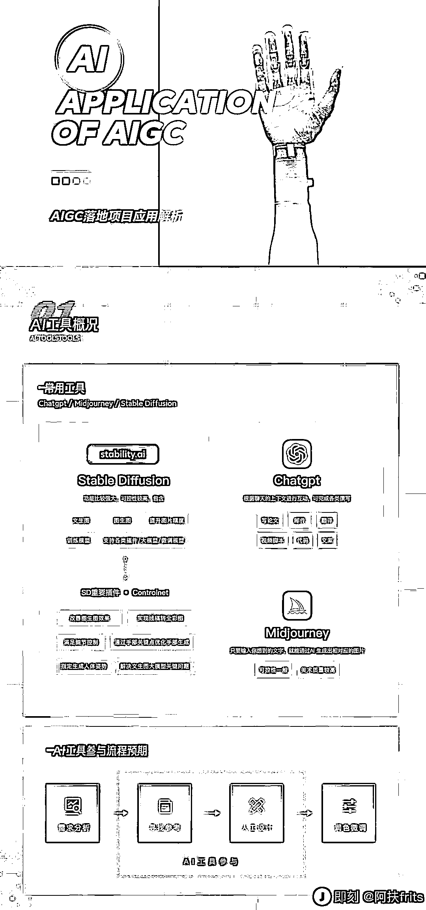
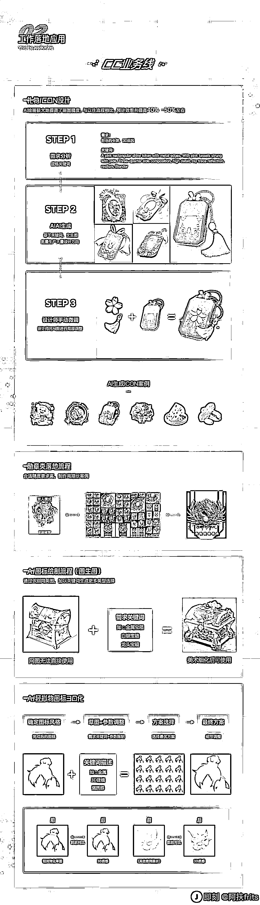
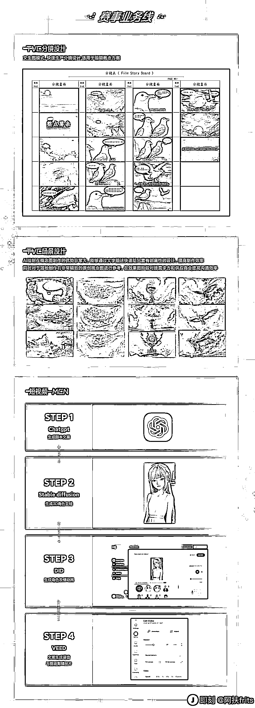
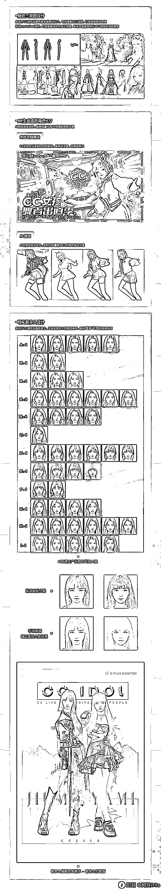

# 网易直接把 AI 设计工作流全部给捋出来了做成长图

> 原文：[`www.yuque.com/for_lazy/xkrm14/as95ias1k3fe1ri3`](https://www.yuque.com/for_lazy/xkrm14/as95ias1k3fe1ri3)

作者： 不期而遇

日期：2023-04-05

点赞数：37

正文：

网易直接把 AI 设计工作流全部给捋出来了做成长图了（出品@网易 CFun 设计中心），是路人行家看了都能一目了然的程度，真的牛👏🏻 感觉大厂们在 AIGC 这块的探索还蛮积极的，下面还有两个相关文档，一并送给有需要的邻居_ 🐧腾讯 ISUX ：《运用 AIGC 人工智能生产内容》 🐷网易严选创新设计中心：《AIGC|探索 AIGC 在网易严选中的应用》 [运用 AIGC 人工智能生产内容](https://mp.weixin.qq.com/s/b10sqhA9-IvUT44U9-5dLA) [AIGC|探索 AIGC 在网易严选中的应用](https://mp.weixin.qq.com/s/GargWzAGH7QyRanIgZxiCQ)

评论区：

暂无评论

