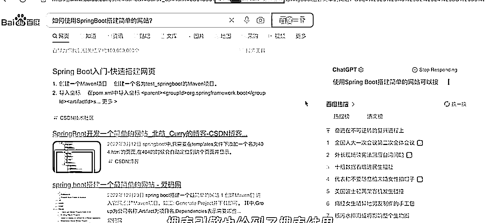

# 数字人应用落地的案例

> 原文：[`www.yuque.com/for_lazy/xkrm14/gya1hvb892mguk1k`](https://www.yuque.com/for_lazy/xkrm14/gya1hvb892mguk1k)

作者： 天堂地狱

日期：2023-04-04

点赞数：82

正文：

关于数字人应用落地的案例。 本来打算写一篇文章，不过实际应用的素材不够， （我们团队刚刚开始跟进的项目，因为暂时没有实际市场结果，） 先写一个风向标，后面补齐文章。 数字人生成+数字人短视频+数字人 ai 脚本直播（可识别字幕播放对应脚本回答直播的实时问题）+直播盒子硬件（直接配置好的主机）+封装好的 WIN 系统（比如 chat gpt 插件浏览器等各种应用插件）=AI 数字人系统 以上所有的技术其实都是相对成熟且市场成本较低技术，但是组合在一起是不是逼格就拉满了，而且可以最低成本的给到非技术，甚至小白使用。 直接吧以上包括操作环境和硬件，封装成一台主机享受溢价。 1\. 数字人生成 应用一些开源技术，成本会低到小几千 这里看这篇文章，我就不多讲了 《数字人技术迭代有多快，成本还能压缩得很低》 2\. 数字人短视频 在数字人的基础上生成短视频几乎零成本 3\. 数字人 ai 脚本直播 可以识别评论提问，然后播放对应脚本，如果之前了解过 AI 电销机器人应该就能明白，逻辑是一个逻辑。 4\. 直播盒子硬件 这里看刀姐的这一篇就够了 不用 OBS 推流做无人直播，与商家合作录制真实直播间，单场销售额超百万的实操分享 5. 把以上应用，硬件方面直接给你组装成电脑（比如数字人对显卡要求还是蛮高的），软件方面，各种应用，直接封装到系统，比如配置好 chat gpt 插件的浏览器。 这个是 B 站的讲解，成本不高。 完成以上几乎纯小白都可以生成自己的数字人，当然，成本不低，但是据我观察，其实价格里面是有很多虚值的，这个方向走下，在这个基础上把个人应用成本拉下来，做到几千块一个数字人服务的话，那岂不是全民人手一个数字人飚短视频？ 直播的应用有门槛，但是也不高，不过不至于全民。 项目我已经在跟了，设备什么的都已经到位，不过最近时间有限，预计是下周才能开始深度研究，到时间再来发一篇。[https://t.zsxq.com/0cLxbHBIJ](https://t.zsxq.com/0cLxbHBIJ) [知识星球+|+深度连接铁杆粉丝，运营高品质社群，知识变现的工具](https://wx.zsxq.com/dweb2/index/topic_detail/214545544525441) [这才是我想要的浏览器！纯干货，建议收藏！！！哔哩哔哩bilibili](https://www.bilibili.com/video/BV1Es4y157mF/?spm_id_from=333.788.recommend_more_video.-1&vd_source=f4abec14ddc3e0bee04122fe0b3fa941)

评论区：

养牛达人福老板 : 这个厉害。。。确实是方向和刚需

济南张亮（手机卡） : 必须给你 108 个赞

正宇 : 我草，这个很强，火钳刘明，

42 : 我们已经在做了

天堂地狱 : 怎么联系?可以撩一撩

老胡 : 出成品了没有

42 : 我们在做教程

水云间 : 有没有硅基那种数字人的教程啊？找了很多，还是觉得硅基的数字人比较好一些，想学习一下。

