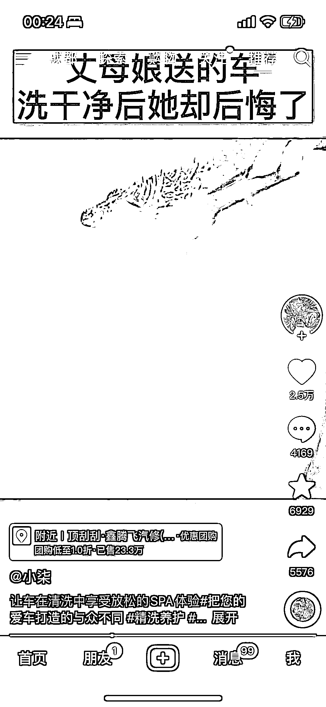
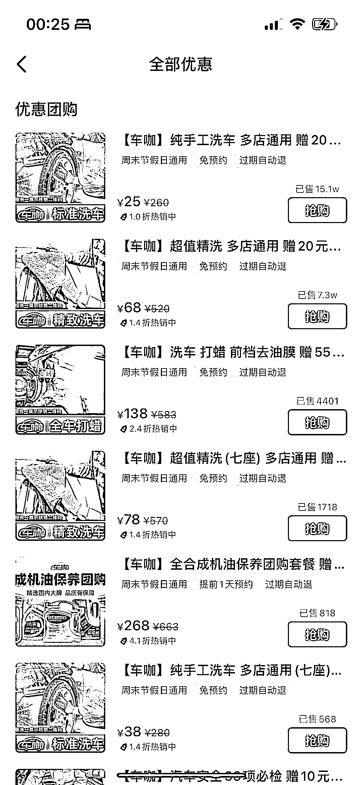

# 抖音，用沉浸式方式推广同城团购

> 原文：[`www.yuque.com/for_lazy/xkrm14/iye8gae8d75bocu0`](https://www.yuque.com/for_lazy/xkrm14/iye8gae8d75bocu0)

作者： 高杰

日期：2023-04-07

点赞数：64

正文：

同城团购流量新玩法，销售数据爆表！ 之前有看到过用沉浸式视频做小说推文，换个思路你可以用沉浸式视频来推荐同城团购业务，也很香 以这个内容案例，全程就是沉浸式洗车，很解压，客户顺手就买个团购券，一般佣金 8%左右，一条视频赚个千把块，还是可以了，关键是可以批量化，混剪，二剪都可以

  

  

  

  

评论区：

Carlchen : 好巧，团队做的项目能成为风向标。谢谢。 借此可以补充一些信息点。视频纯自然流，内容发布前这个账号只有几个粉丝，且是一些生活个人记录。最后一个，本地生活今年增长迅猛。

