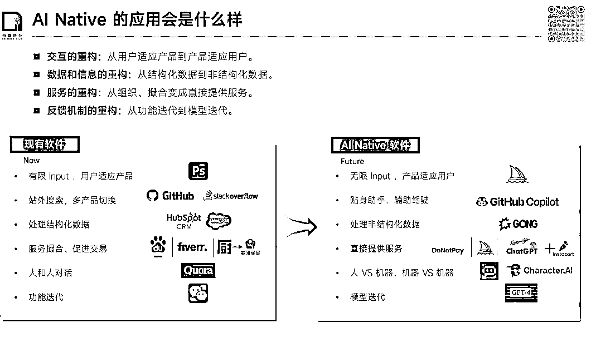

# 《OpenAI 闭门讨论会》的会议总结

> 原文：[`www.yuque.com/for_lazy/xkrm14/wwqtgkdsryw85i1u`](https://www.yuque.com/for_lazy/xkrm14/wwqtgkdsryw85i1u)

作者： 杨昌

日期：2023-04-07

点赞数：20

正文：

从 mobile native 到 LLM native，谁将是下一个抖音、微信？ 最近在看拾象的《OpenAI 闭门讨论会》系列，发现他们对 LLM native 的讨论也比较深入。 第 3 期讨论中，有人提到： “下一个时代的张小龙、一鸣、宿华应该长什么样子？ 首先这几个人都很熟悉互联网 mobile 的特点，其次抓住了关键要素，比如头条把商业化、公司组织、机器学习技术的引入抓得非常好。 下一代产品经理，可能是对大语言模型某个被大家忽视的关键点上能做得特别好。” 虽然他们自己也说：“关于 AI native，其发展进度还不足以令我们做出一个假设。”但在他们的公众号「海外独角兽」的《The Age of AI：拾象大模型及 OpenAI 投资思考》文章中，有大段关于 AI native 的分析，个人总结如下： 一、AI Native 的应用会是什么样？ 1、交互重构： 从以前的用户适应产品，变成今后的产品适应用户。 比如设计领域，从 PS 学一大堆，到 midjourney 你瞎说啥它都给你画出来 2、数据和信息重构： 从以前必须要做大量数据整理提交结构化数据才跑得起来，到现在 AI 驱动它自行理解了我们的非结构化数据。 “CRM 记录姓名、电话等结构化数据，以 Gong 为代表的 AI-based CRM 则是记录分析 B2B 销售和客户录音。 人们常说数据是石油，LLM 明显把炼油能力增强了，高价值行业和企业内部曾经难记录、难处理的数据都可以被重新以前分析。 数据和信息的重构也意味着 AI 能承担更多决策权。” 3、服务的重构： 从以前的各种撮合，到后续的直接匹配&交易，让消费决策到交易/合作发生的链路变短。 比如要搜个东西，百度搜半天搜不明白，各种奇奇怪怪的链接把我们导向其他地方，但现在只要问问 GPT-4，整理好的答案直接给过来，无比丝滑。 再比如，我去淘宝、京东、拼多多上买东西，现在要看大量详情页信息和用户评论，只为了知道几个小问题的答案，设想一下，今后我只要把问题总结好，GPT1 秒钟内直接把两端的信息都理解完、匹配好，那我还用花那么多时间吗？ 4、反馈机制的重构： 从以前 app 两周更新一个版本就很快了，到现在每时每秒都在互动中迭代算法 “生成模型为基座的产品，不仅能通过 context learning 的能力让用户多轮尝试，纠正输出结果，还能根据用户产生的数据和反馈迭代模型。 ChatGPT 是把数据飞轮做得很好的爆款产品，GPT-4 的贡献者名单里还有专门的 data flywheel 负责人。 Midjourney 的四选一，Poe、Character.ai 设置的 like 和 dislike 按钮，都是一些获取用户反馈的方法。” 二、 LLM native 的抖音、微信可能在哪里？ 在第三次闭门会中，他们讨论到： “微软的 Copilot, 谷歌的 workspace 都是指向一个方向的。 国外 AIGC 的公司有大约 610 家，AI native 的 app 一定会从这 610 家中跑出来。 所以一个思路是去持续跟踪、试用这些 AIGC 公司的产品，然后从中不断获得启发。” 那么，我们先看看科技大厂现阶段是如何使用 LLM 的吧。文章中指出，二级市场上市科技公司、科技独角兽在和 LLM 结合中找的场景，可以大体分为四类： 1、 作为内部提效工具，省成本 数据审核、产品开发、客服等都是典型的运用场景，比如： bubble：将 LLM 集成进入审核系统，加快文字及照片审核效率。 chime：用 ChatGPT 结合公司代码库提高开发效率。 2、自然融入现有业务场景： 大多数公司在做的尝试都属于这一类场景，在具体的实践上，大家的普遍做法就是说不断测试场景，最后可能挑出来 10- 20 个比较好的，再到后期选择 4-5 重点去做。 3\. 利用大模型对过去比较难的业务进行突破： 有一些公司会说将希望 LLM 成为一个突破点，来实现过去很难做起来、或者很难突破的业务。 比如 Zoom ，他们一直想要突破“开会软件”的限制，也因此推出了 VoIP、Zoom IQ for Sales 等新业务，目前也是通过叠加 AI 能力来做突破，并且 Zoom 的执行力层面比竞争对手更快，可能会帮助他们在订单层面获得一些突破。 4\. 通过 LLM 获得新的战略增长点： 典型代表是微软 Azure 和 OpenAI 的结合。Azure 成为了在 Al 方向最领先的超级计算云。 Salesforce 也是比较典型的实操案例。客户必须基于 Salesforce 的数据湖仓 Genie 使用 Einstein GPT, 推动 Salesforce 占住数据云。 最后，把第 3 次闭门会的一段话，送给各位： “自然语言到每个人可用的编程工具是巨大的生产力革命，给每一个人赋予了一个跟数字世界的一个接口。 natural language to everything，整个生产力的解放和革命，也是逐渐下沉的一个过程。 比如从 Adobe 到 Figma，工具的易用化带来可用人群的旷大， 都会创造一些百亿美金的公司。 而 Native Al 将这一过程可以延伸到许多领域。” —————— 链接： ①公众号文章： ②闭门会纪要：[The+Age+of+AI：拾象大模型及 OpenAI 投资思考](https://mp.weixin.qq.com/s/AxX-Q7njegNTAxMkYFwsfA) [发现报告+-+专业研报平台丨收录海量行业报告、券商研报丨免费分享行业研报](https://www.fxbaogao.com/view?id=3617847)

  

  

评论区：

乐活派 : 歪个楼，打听下 gpt4 还能充吗[呲牙]

杨昌 : 有的可以

