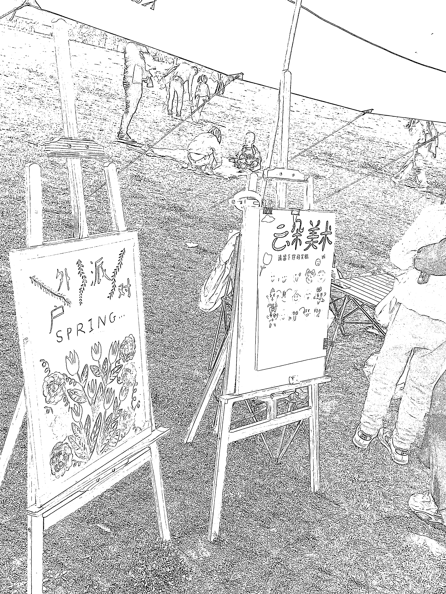
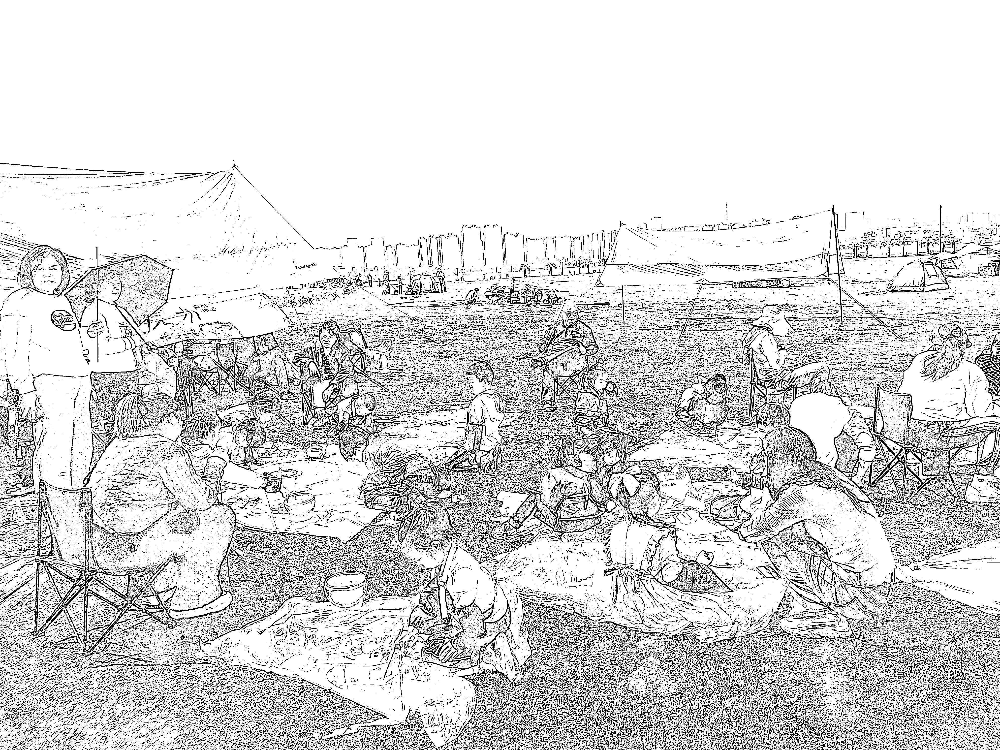
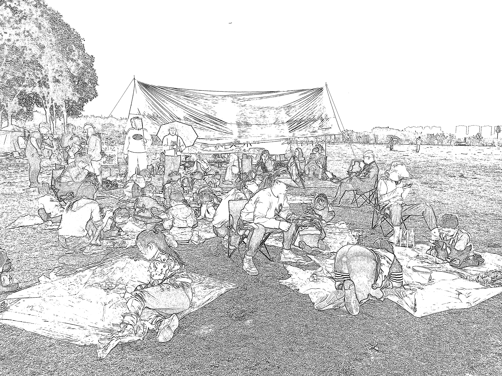
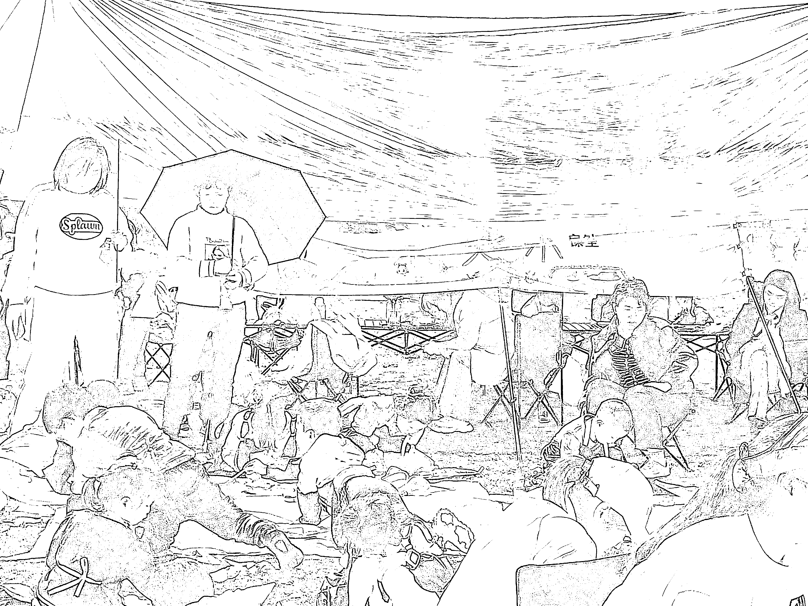

# 一个画画的机构，开展的“风筝🪁节”

> 原文：[`www.yuque.com/for_lazy/xkrm14/xuo0g2gkytlcgp4i`](https://www.yuque.com/for_lazy/xkrm14/xuo0g2gkytlcgp4i)

作者： 剽悍的大春

日期：2023-04-07

点赞数：39

正文：

周末看到很多培训机构～进行户外活动！ 这种活动很吸引人～一个画画的机构，开展的“风筝🪁节” 主题:“让自己的愿望飞上天” 每一个小孩子可以画一些内容简介或话语，邀请家长一起参加！！ 很好的户外活动，很适合机构类或者做户外拓展类的人操作

评论区：

骏马 : 活动不错，但有点踩踏草坪的嫌疑

剽悍的大春 : 户外的草坪一般都是开放的[爱心]

詹伟平 : 户外亲子游很火

