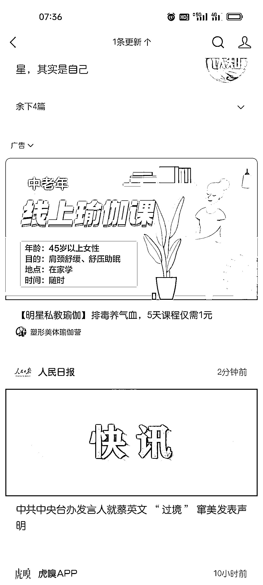

# 可以考虑做类似线上瑜伽课的中老年入门课程

> 原文：[`www.yuque.com/for_lazy/xkrm14/fp4g9xfsl53zwzuh`](https://www.yuque.com/for_lazy/xkrm14/fp4g9xfsl53zwzuh)

作者： 可伊

日期：2023-04-06

点赞数：61

正文：

看到一个中老年线上🧘‍♀️瑜伽课的引流 最基础的内容 有一技之长，或者对某个领域很感兴趣的圈友可以考虑做类似的中老年入门课程，而且很多课程内容网上也可以搜索到 比如说，中老年唱歌，中老年交谊舞，中老年摄影，中老年绘画等等。

评论区：

波叔 : 中老年交友需求也挺大[偷笑]

可伊 : 哈哈哈那确实[偷笑]

丑八怪 : 这里有一个需求，像到了我爸妈这个年纪，我观察到普遍他们都有睡眠障碍。。。。

雨林 : 这个不止父母了 助眠那么好做就是失眠早就年轻化了

周彦充 : 中老年应该有钱，有闲

平 : 失眠这块的变现，要么做正念的培训，要么卖产品，我去年就是在抖音上做直播卖酸枣仁，就是针对失眠人群的，没做起来，对标的是河北的一个账号，他们每天卖三四百单，已经卖到头部。后面小卖家想进去好难，投流费根本支撑不了。特别要想好变现方式

