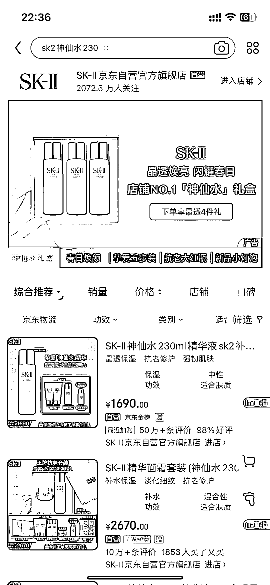

# 大牌美妆这个行业的水很深，毛利也很充足

> 原文：[`www.yuque.com/for_lazy/xkrm14/zgf6yxbuadsgvzhv`](https://www.yuque.com/for_lazy/xkrm14/zgf6yxbuadsgvzhv)

作者： Knight

日期：2023-04-05

点赞数：52

正文：

最近在整理供应链货源的时候，想起来了大牌美妆。这个行业的水很深，毛利也很充足，2020 年 12 月，我在深圳华强北走访 3C 供应链的时候，无意间发现同一个园区居然有几栋楼里布满了大量的大牌化妆品档口，并且商场开发了小程序专门发布各个档口的产品和价格。SK2 神仙水 230ml，京东礼盒装 1690，档口单支价格 800 左右，大多数是日韩包装。货源一般来说没有问题，偶尔也会有档口被园区清理，懂行的圈友注意辨别。比较适合做朋友圈和私域运营的圈友试水，支持一件代发。

评论区：

我的执着 : 方便留个联系方式或者地址？

Knight : 圈友好，VX：Knight7v2023

Knight : 私信我的圈友太多了，来不及一一回复，在此公布小程序名称：通姆找货。再次提醒大家，注意甄别货源

Knight : 更新：小猪找货

陆左 : 提醒一下，这个里面很多假货[囧]，主要看能不能遇到良心商家。

Knight : 是的，所以我特意强调注意辨别

安神 : 明通找货

Knight : 感谢补充

