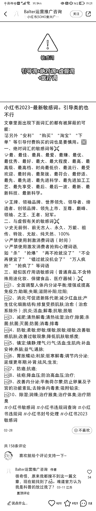

# 2023 小红书最新敏感词汇，引导词也不行

> 原文：[`www.yuque.com/for_lazy/xkrm14/bx9ivqn3rekg7cgk`](https://www.yuque.com/for_lazy/xkrm14/bx9ivqn3rekg7cgk)

作者： 波本零

日期：2023-04-07

点赞数：143

正文：

2023 小红书最新敏感词汇，引导词也不行，例如“安利”“购买”等

评论区：

程序羱 : 刚好在尝试小红书赛道，感谢分享

艺荷 : 这么多不能用的，那感觉每次写的时候都得对照着才行啊😂

veteran : 把图片转文字保存好，有风险的词直接查找

艺荷 : 好，立马存，谢谢

惟乔 : 直接甩给 gpt，让他规避这些词

蛋蛋。 : 这么多不能用...

星夜 : 小红书这种乱七八糟的 爆文，发布的内容不是垂直的领域 ，比如男朋友包里有什么，的这些文章小爆啦，是怎么变现的

周彦充 : 最都不行了，怪不得没流量

