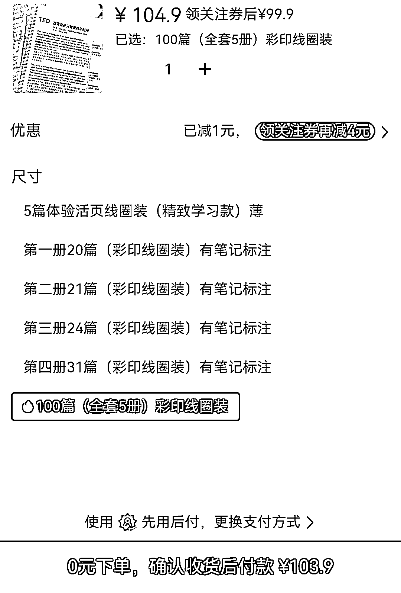

# 拼多多卖资料，店铺卖出了 6W 多的形式

> 原文：[`www.yuque.com/for_lazy/xkrm14/tr1g0a8zw5gu2dpt`](https://www.yuque.com/for_lazy/xkrm14/tr1g0a8zw5gu2dpt)

作者： 李纳

日期：2023-04-05

点赞数：38

正文：

拼多多卖资料，店铺卖出了 6 万多；分为几种形式： 1⃣PDF 电子版； 2⃣打印版： ▶️黑白、彩色、有笔记、无笔记版本； ▶️打印活页笔记+线圈装订版； ▶️打印活页笔记+软皮文件夹。

评论区：

AQ : 最后截图的个人信息处理一下

汉智平 : 这么多人买

抖 sir : 兄台，把你个人信息打一下码吧😄😱

lucky : 这个有版权吗

李纳 : 版权肯定在 ted（美国公司）手上，就是我看国内最近卖英语资料挺多它家的，还没被跨过投诉吧

李纳 : 谢谢

李纳 : 处理了处理了

Luke 王子 : PDD 的销量是可以随意改的，看评价数量，1:10

