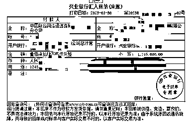

# 携号转网是本地业务，佣金要比 400 多的多

> 原文：[`www.yuque.com/for_lazy/xkrm14/gf133gi13xovs9cw`](https://www.yuque.com/for_lazy/xkrm14/gf133gi13xovs9cw)

作者： 地表最强运营商 帅方

日期：2023-04-04

点赞数：120

正文：

刚刚看到了这个风向标。携号转网确实是个好业务 携号转网是本地业务。佣金要比 400 多的多。。这个是终身返利 15～20 多个点。税前。 注意是终身返利。一个客户赚个一万都可以。只是因为他是线下业务。具体到区了都。所以线上很难放大 像我们这种资费大流量卡运营商甚至能给到 70%、80%的返利（两年） 两年就可以足矣支撑得起上百家年入千万的公司。更别提终身返利了。这是个闷声发财的业务

评论区：

地表最强运营商 帅方 : 图 2 是我司 2 月份的后结算部分佣金。感兴趣的人多我可以再写一篇精华帖把运营商行业给你们扒的底朝天[呲牙][呲牙][呲牙]

地表最强运营商 帅方 : 而且携号转网基本都是跟宽带固网业务一起做的。单固网在电商平台一家店就可以有 10 万+每个月的利润。做区域流量基本没竞争

掉在 marvel 坑里 : 蹲一个

北辰 : 难怪每个月都被骚扰，烦死，原来利润这么大。

A 潘典 君和联行 : 蹲一篇精华

大支 : 蹲一个

忘川 : 蹲蹲

小宝 : 蹲一篇精华

