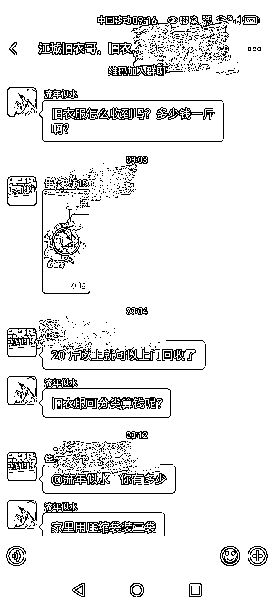

# 微信，旧衣服回收项目的引流方式

> 原文：[`www.yuque.com/for_lazy/xkrm14/ynrtas4ysf9gb3p1`](https://www.yuque.com/for_lazy/xkrm14/ynrtas4ysf9gb3p1)

作者： 三个问号

日期：2023-04-05

点赞数：23

正文：

旧衣服回收，圈里面很多人都知道这个项目，但是这位群主引流方式就很特别，瞬间裂变很多群， 具体方法： 1.去本地二手市场拍图片和视频，以家用电器和装修用品为主，比如沙发、浴霸、热水器，等一切实用产品，二手七八成新的低价抛售往群里丢， 2.需要购买的加群主微信，看了下微信朋友圈全是上门回收旧衣服的现场图片因为都是同城，现场图片和朋友圈定位让人一看就很亲切， 3.成交的时候拍付款截图照片然后在发到群里留钩子，

评论区：

暂无评论

