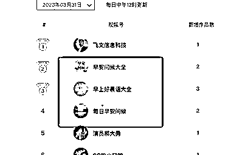

# 新榜查询视频号日榜异常值

> 原文：[`www.yuque.com/for_lazy/xkrm14/grfynow4oxim7eds`](https://www.yuque.com/for_lazy/xkrm14/grfynow4oxim7eds)

作者： 老孙说经济

日期：2023-04-03

点赞数：28

正文：

新榜查询视频号日榜异常值。前 5 名中有 3 个都是早安语录（图一） 经过追源发现是同一个人的帐号，并且流量都不错，都绑定了公众号(图二），一鱼多吃 仔细分析作品流量大的原因(图四图五) 1.视频内容为 ppt 图片，图片为 ai 出图，所以都是原创，没有限制 2.选题符合老人人群调性 3.音频内容是今天是 xxx 号星期 xx。送你 xxx 祝福各位 xxx，内容吸引人， 4.数量足够多，矩阵帐号 疑惑的地方 如何进行变现了，流量是很大，都是送祝福的，卖挂历？

  

评论区：

骏马 : 流量主

飞鸡壳壳 : 1.在推文里面插广告 2.文章底部广告 3.引流到小程序付费制作同款视频

