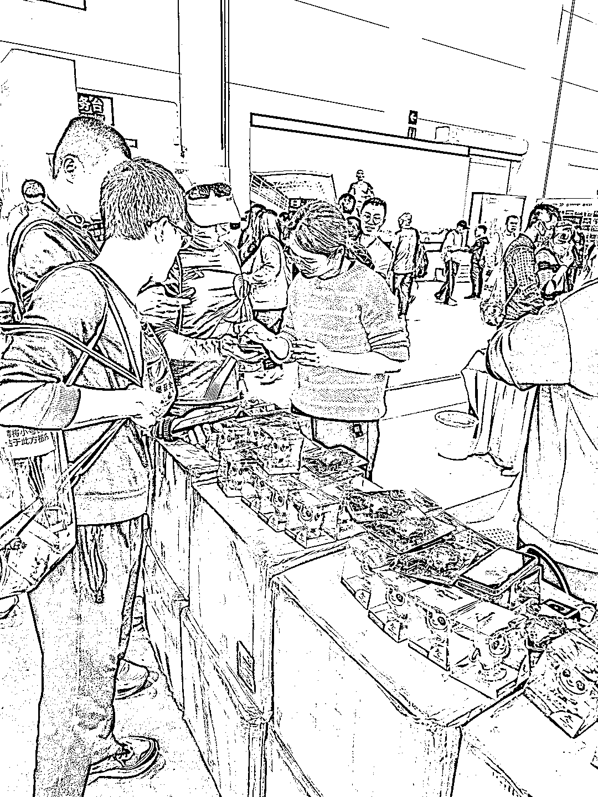
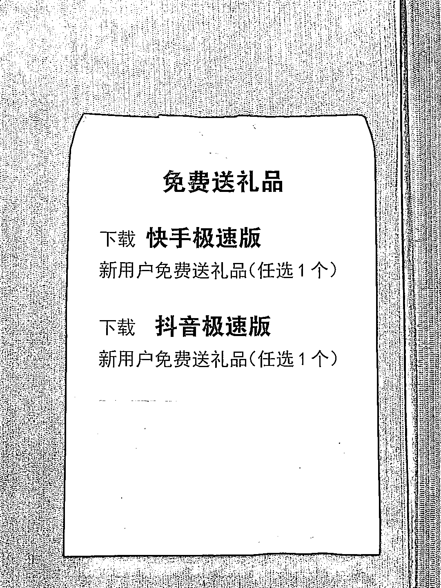

# 到大型展会线下拉新，流量好

> 原文：[`www.yuque.com/for_lazy/xkrm14/mkh1bwclnwf13qcu`](https://www.yuque.com/for_lazy/xkrm14/mkh1bwclnwf13qcu)

作者： 斑马森林

日期：2023-04-07

点赞数：75

正文：

上周末参加马拉松，领物资的时候，在展馆内有个“特殊的展位”，快手极速版拉新展位。 展位的布置很简单，桌面摆满了拉新礼品冰墩墩（大到模型，小到钥匙扣），拉新人员大概有十来个人，每个人手上都拿着他们自己的拉新二维码。 跟他们聊了会，他们是全国范围流动，主要看哪里大型展会就去哪里，比如马拉松或者博览会等，一天一个人能拉新 50 到 100 个左右，小团队 10 个人起，收益挺可观的。 今年开始，随着疫情放开，大型的赛事和展会都在陆续举办，这种活动有个特点就是场地密封，用户集中，不用自己找用户，拉新流程简单，奔着薅羊毛的心理，很多用户也愿意下载 App

评论区：

平凡不平凡 : 厦门的？？厦门有没有生财群？

Aaron : 这种拉新一个有多少钱啊

丘水伊 : 怎么联系他们？广西南宁 5 月有个大型活动 3 天 500 人想找赞助

斑马森林 : 这是拉新团队，不是赞助商

文一 : 生财一般没有微信群噢，只有航海等实践活动才会拉群

晴天哥哥 : 问问鱼丸～

A 孟世扬 : 抖音极速 21，快手极速版 17 七留 42

A 孟世扬 : 要出摊位费的，厦门不知道，北京这么大位置至少几万块

