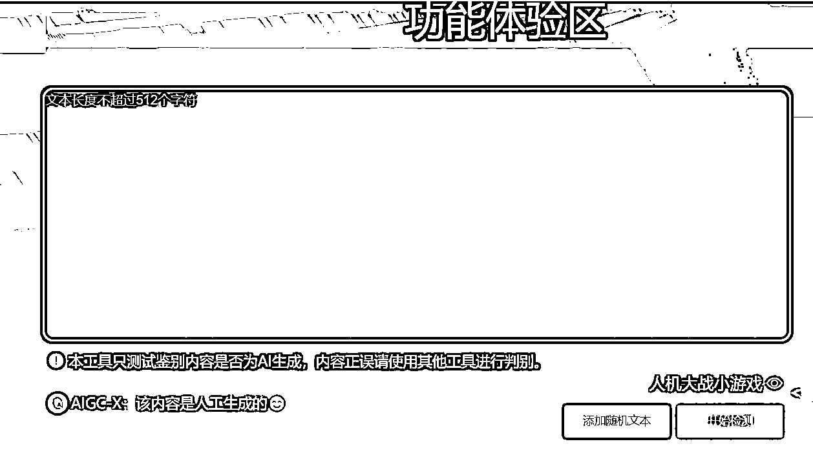

# 工具分享：AI 生成内容检测应用

> 原文：[`www.yuque.com/for_lazy/xkrm14/iedtlw9uht10bcdc`](https://www.yuque.com/for_lazy/xkrm14/iedtlw9uht10bcdc)

<ne-p id="ud512b57f" data-lake-id="ud512b57f"><ne-text id="u209d358f">作者： 仲子</ne-text></ne-p> <ne-p id="u954035bf" data-lake-id="u954035bf"><ne-text id="u0644c537">日期：2023-03-31</ne-text></ne-p> <ne-p id="u2810ae81" data-lake-id="u2810ae81"><ne-text id="u3ea20cf0">点赞数：</ne-text><ne-text id="uae85454a" ne-bold="true">71</ne-text></ne-p> <ne-hole id="u72c10b04" data-lake-id="u72c10b04"><ne-card data-card-name="hr" data-card-type="block" id="OY81x" data-event-boundary="card"><ne-p id="u8ced73f6" data-lake-id="u8ced73f6"><ne-text id="uceaa5242">正文：</ne-text></ne-p> <ne-p id="u5af9e687" data-lake-id="u5af9e687"><ne-text id="u86499455">反 AI 生成算法来啦 AI 算法生成内容检测工具，可以快速分辨出内容是机器生成还是人工生成的。 大家试试准不准？[呲牙]</ne-text> <ne-text id="u13bdcf02">传播内容认知全国重点实验室、中国科学技术大学、合肥综合性国家科学中心人工智能研究院联合推出</ne-text>[<ne-text id="uf73cd307">AIGC-</ne-text> <ne-text id="u1b3ecc00">X 人民网国重、中科大联合推出的 AI 生成内容检测应用，可以快速分辨出内容是机器生成还是人工生...</ne-text>](http://ai.sklccc.com/#/try)</ne-p> <ne-p id="ue0f80edd" data-lake-id="ue0f80edd"><ne-card data-card-name="image" data-card-type="inline" id="jgXEx" data-event-boundary="card"></ne-card></ne-p> <ne-p id="u53134da2" data-lake-id="u53134da2"><ne-card data-card-name="image" data-card-type="inline" id="wtKbe" data-event-boundary="card">  <ne-hole id="u17b74212" data-lake-id="u17b74212"><ne-card data-card-name="hr" data-card-type="block" id="OI722" data-event-boundary="card"><ne-p id="ue65179cf" data-lake-id="ue65179cf"><ne-text id="u72af84c7">评论区：</ne-text></ne-p> <ne-p id="ufb3ad84a" data-lake-id="ufb3ad84a"><ne-text id="u54279c9a">远方 : 不怕，生财人都会去重呀</ne-text></ne-p> <ne-p id="u67b9c342" data-lake-id="u67b9c342"><ne-text id="ub6ea3a81">坤坤 : 要开始博弈了🤓</ne-text></ne-p> <ne-p id="ueac86349" data-lake-id="ueac86349"><ne-text id="u8210d180">仲子 : 怎么辨别内容是不是 AI 写的，今天又研究了下，整理汇总了几个其他反 AI 生成算法网站工具。可以参考。</ne-text> [<ne-text id="u29a30fa6">反 AI+生成算法，Chatgpt+你怕了吗？</ne-text>](https://mp.weixin.qq.com/s/yvzNZWjMhqLCKTL9NuDtNA)</ne-p> <ne-p id="u19597b78" data-lake-id="u19597b78"><ne-text id="u8961546d">晓岚 : 这个东西出来了一段时间了。其实我还没想太仔细啥情况下需要检查呢</ne-text></ne-p> <ne-p id="u89dd41f7" data-lake-id="u89dd41f7"><ne-text id="u942125ec">你好大吴 : 哈哈哈哈</ne-text></ne-p> <ne-p id="u60bad0c1" data-lake-id="u60bad0c1"><ne-text id="uc630ff2f">奶爸超人 : 我贴了一段 GPT 生成的，被判断为人工生成。</ne-text></ne-p> <ne-p id="u0227ce1f" data-lake-id="u0227ce1f"><ne-text id="u8cd0ea19">仲子 : 目前准确率确实有待提高，我把 AI 唐诗贴进去也识别不出来</ne-text></ne-p> <ne-p id="u26ae605c" data-lake-id="u26ae605c"><ne-text id="ucd661d4d">仲子 : 什么时候需要检测？我想了下场景，主要老师可能会最先用，其次消费者你看下好物分享的，是不是机器写的。整理了一篇</ne-text> <ne-text id="u25eff0fd">随着 Ai 普及，肯定会需要这方面服务</ne-text>[<ne-text id="u701d695a">你的情书真的是他写的吗？+男生勿进！</ne-text>](https://mp.weixin.qq.com/s/04ezjXUBacPZC1TRBVEByg)</ne-p> <ne-hole id="u5f355901" data-lake-id="u5f355901"><ne-card data-card-name="hr" data-card-type="block" id="P4KEJ" data-event-boundary="card"><ne-p id="u77b5db86" data-lake-id="u77b5db86"><ne-text id="u1efbca1b">公众号懒人找资源，懒人专属群分享</ne-text></ne-p></ne-card></ne-hole></ne-card></ne-hole></ne-card></ne-p></ne-card></ne-hole>