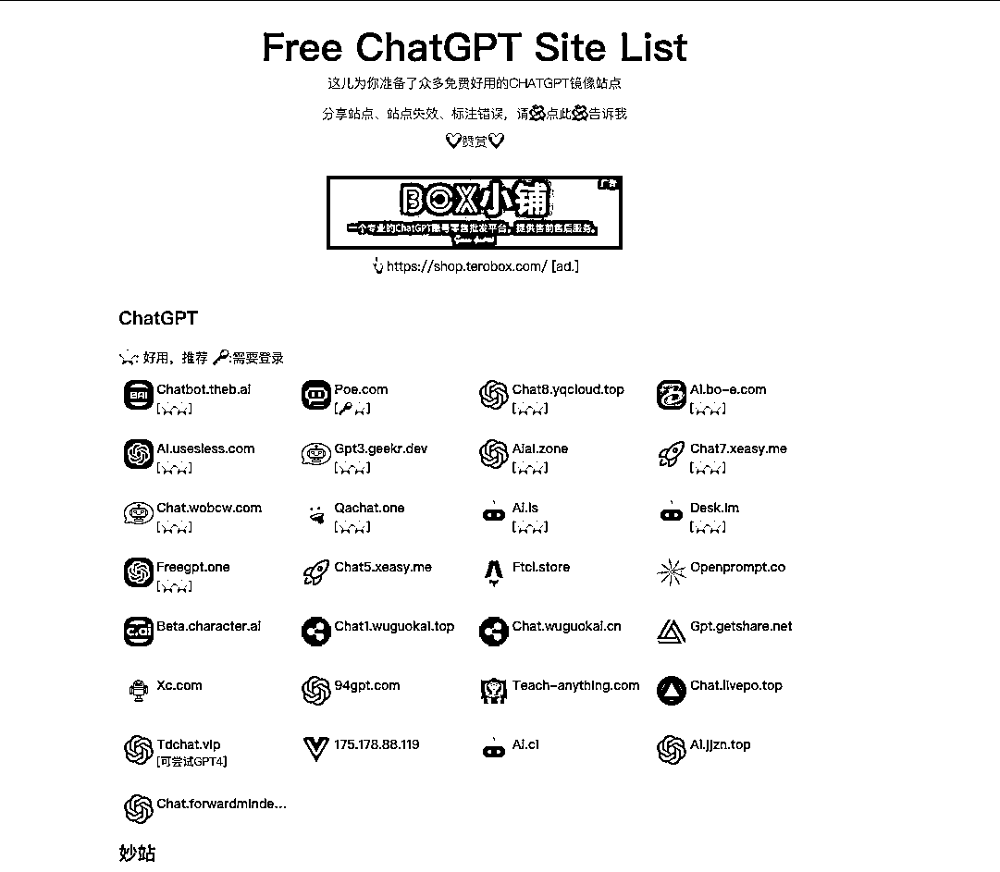

# ChatGPT 导航网站，流量很大

> 原文：[`www.yuque.com/for_lazy/xkrm14/kwl5v44zmugctui4`](https://www.yuque.com/for_lazy/xkrm14/kwl5v44zmugctui4)

作者： 王马扎

日期：2023-03-30

点赞数：54

<ne-hole id="ufdbb2566" data-lake-id="ufdbb2566"><ne-card data-card-name="hr" data-card-type="block" id="Xx9fa" data-event-boundary="card">

正文：

【Chatgpt 导航网站】 在当下 chatgpt 风口，做一个类似 hao123 一样的 chatgpt 应用导航网站，是一个不错的思路。 记得顾小北老师也做了一个跨境电商领域的导航网站，流量很大。 链接：[Free+ChatGPT+Site+ListFree+ChatGPT+Site+List](https://cc.ai55.cc/)

<ne-card data-card-name="image" data-card-type="inline" id="xyWbW" data-event-boundary="card">  <ne-hole id="ub29e44eb" data-lake-id="ub29e44eb"><ne-card data-card-name="hr" data-card-type="block" id="utPGb" data-event-boundary="card"><ne-p id="ub79ac696" data-lake-id="ub79ac696">评论区：

短视频 I 直播 I : 网址是否分享下谢谢

王马扎 : 谢谢提醒，已经把链接放上了

杰克船长 : 你做的？

王马扎 : 不是

August : 打不开呢？

王马扎 : 刚试了一下可以

木子李 : 可以搞一个 AI 应用程序的导航站

<ne-hole id="u89f411ae" data-lake-id="u89f411ae"><ne-card data-card-name="hr" data-card-type="block" id="OznUp" data-event-boundary="card">

公众号懒人找资源，懒人专属群分享

</ne-card></ne-hole></ne-card></ne-hole></ne-card></ne-p></ne-card></ne-hole>