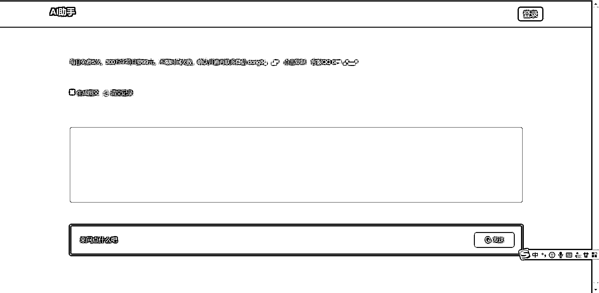
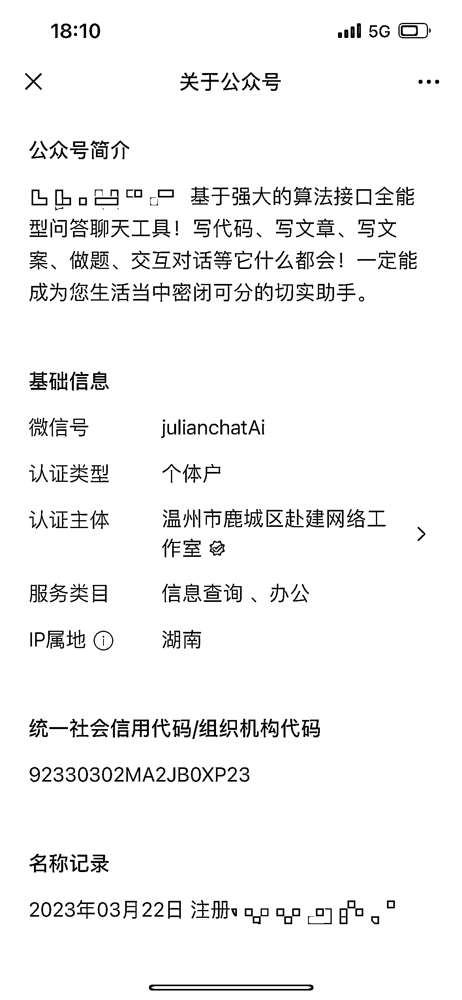

# 在 Bing 铺 ChatGPT 的 SEO 进行私域引流

> 原文：[`www.yuque.com/for_lazy/xkrm14/hzb8690btsswug1w`](https://www.yuque.com/for_lazy/xkrm14/hzb8690btsswug1w)

<ne-p id="u5bb194f1" data-lake-id="u5bb194f1"><ne-text id="u7901ec97">作者： 枸艾梦</ne-text></ne-p> <ne-p id="ue2eabcae" data-lake-id="ue2eabcae"><ne-text id="ua3c6d0c8">日期：2023-03-29</ne-text></ne-p> <ne-p id="u6a6ee4ec" data-lake-id="u6a6ee4ec"><ne-text id="u774586d8">点赞数：</ne-text><ne-text id="uebd53ca6" ne-bold="true">20</ne-text></ne-p> <ne-hole id="uccbd7eb9" data-lake-id="uccbd7eb9"><ne-card data-card-name="hr" data-card-type="block" id="VFKf8" data-event-boundary="card"><ne-p id="u4a1393bd" data-lake-id="u4a1393bd"><ne-text id="udd0de93e">正文：</ne-text></ne-p> <ne-p id="uf85d78ee" data-lake-id="uf85d78ee"><ne-text id="u813cf302">今天在 bing 上直接搜索 chatgpt</ne-text> <ne-text id="u09a901e3">点开广告下面的几个在线网站基本都是免费体验几次回答次数之后进行限制，引流私域进行变现，看了下公众号注册日期也就几天前的事情。</ne-text></ne-p> <ne-p id="u939e2620" data-lake-id="u939e2620"><ne-card data-card-name="image" data-card-type="inline" id="n127R" data-event-boundary="card">  <ne-p id="ua42aaea5" data-lake-id="ua42aaea5"><ne-card data-card-name="image" data-card-type="inline" id="GW5Ng" data-event-boundary="card">  <ne-p id="u2e364c6f" data-lake-id="u2e364c6f"><ne-card data-card-name="image" data-card-type="inline" id="jHF1a" data-event-boundary="card">  <ne-hole id="u41a7c533" data-lake-id="u41a7c533"><ne-card data-card-name="hr" data-card-type="block" id="MRzFL" data-event-boundary="card"><ne-p id="ua23b6a71" data-lake-id="ua23b6a71"><ne-text id="u0a561200">评论区：</ne-text></ne-p> <ne-p id="ue995bbe5" data-lake-id="ue995bbe5"><ne-text id="ufe23c594">正宇 : 速度快</ne-text></ne-p> <ne-hole id="udfe4340f" data-lake-id="udfe4340f"><ne-card data-card-name="hr" data-card-type="block" id="pMpca" data-event-boundary="card"><ne-p id="u4e011d7a" data-lake-id="u4e011d7a"><ne-text id="u9d629bc9">公众号懒人找资源，懒人专属群分享</ne-text></ne-p></ne-card></ne-hole></ne-card></ne-hole></ne-card></ne-p></ne-card></ne-p></ne-card></ne-p></ne-card></ne-hole>