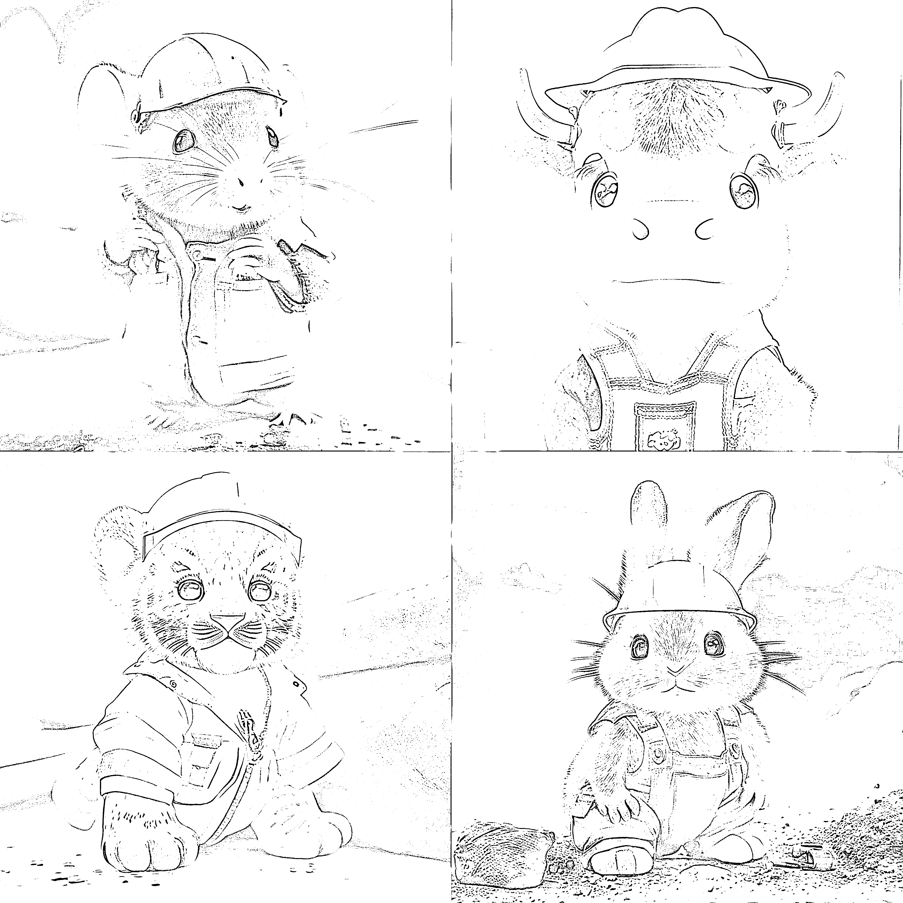

# 将 Midjourney 接入 AI 绘画小程序，生成专属头像

> 原文：[`www.yuque.com/for_lazy/xkrm14/di2omqhqp7l0rm2k`](https://www.yuque.com/for_lazy/xkrm14/di2omqhqp7l0rm2k)

作者： 离心之巅

日期：2023-03-29

点赞数：47

<ne-hole id="ue274c45b" data-lake-id="ue274c45b"><ne-card data-card-name="hr" data-card-type="block" id="si6m6" data-event-boundary="card">

正文：

十二生肖壁纸在各大平台都比较火，midjourney 同一组关键词只需要修改对应动物和职业就可以生成不同的图。思路扩展下，可不可以做个 ai 绘画小程序接入 midjourney，只需要用户输入他的生肖和职业，不懂 ai 绘画的小白也能生成自己专属头像

<ne-card data-card-name="image" data-card-type="inline" id="r43sK" data-event-boundary="card"></ne-card>

<ne-card data-card-name="image" data-card-type="inline" id="xqgLe" data-event-boundary="card"></ne-card>

<ne-card data-card-name="image" data-card-type="inline" id="nwwtp" data-event-boundary="card"></ne-card>

<ne-card data-card-name="image" data-card-type="inline" id="eZadz" data-event-boundary="card"></ne-card>

<ne-hole id="uefe0137e" data-lake-id="uefe0137e"><ne-card data-card-name="hr" data-card-type="block" id="QCiHa" data-event-boundary="card">

评论区：

<ne-hole id="u6bd89bcf" data-lake-id="u6bd89bcf"><ne-card data-card-name="hr" data-card-type="block" id="I3Jaz" data-event-boundary="card">

公众号懒人找资源，懒人专属群分享

</ne-card></ne-hole></ne-card></ne-hole></ne-card></ne-hole>