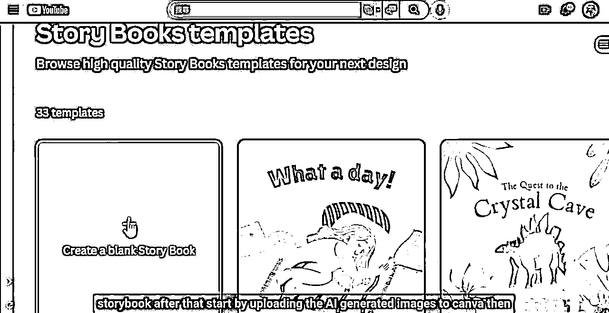
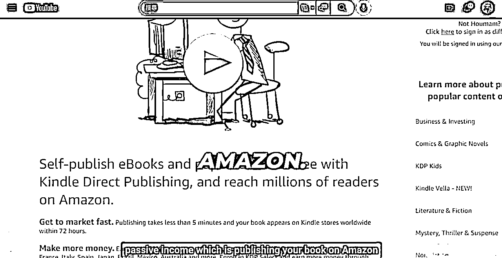

# 用 AI 工具创作儿童绘本，上架亚马逊售卖

> 原文：[`www.yuque.com/for_lazy/xkrm14/ank7okf10tb89p8t`](https://www.yuque.com/for_lazy/xkrm14/ank7okf10tb89p8t)

作者： 🐵Sunday🐵

日期：2023-03-29

点赞数：82

正文：

🧒用 AI 工具创作儿童绘本，上架 amazon 赚钱 一油管博主 10XINCOME 📚这个视频主要分享了借助 AI 工具创作儿童绘本，在 amazon 上线售卖💰的流程方法。 选择儿童绘本的原因是:1 文案和插图的数量要求都不高，可以很快创作完成。2、儿童绘本一直是图书销售的热门，销量可观。 🧰使用到的工具和流程: 1、ChatGPT:生成儿童故事大纲和内容 故事标题和章节分开创作，选定标题后再进行衍生。绘本的故事和内容都很简单，可以很快创作完成。 2、Midjourney 根据文案创作绘本插画 复制故事情节文案，用 Midjourney 生成对应画面，这里要注意首次生成人物角色后要导出保存，后续画面需要垫图，以保持角色形象一致。 3、canva:使用免费模版排版 选择故事书模版，上传上一步生成的插图和文案进行排版，完成所有页面后，导出 pdf。 4、amazon:在 KindleDirectPublishing 平台免费出版绘本，上架 amazon 销售。 这一步可以关键词，查询详细步骤。 AI 工具的出现让出售虚拟产品赚钱变得更容易了，插画设计师也可以试试这个流程，创作自己的绘本。 研究亚马逊跨境电商的朋友也可以考虑下这个方向，快去看看吧~

  

  

  

  

  

  

  

评论区：

金九渊 : 国内有没电子书售卖平台

🐵Sunday🐵 : 上个海外电商的航海

光追 20220908 : 理论上都可行，赚的其实也是个搬运的钱。

🐵Sunday🐵 : 对的，没错

金九渊 : 棒

书生 : 这个强

公众号懒人找资源，懒人专属群分享

</ne-p></ne-p></ne-p></ne-p></ne-p></ne-p></ne-p>