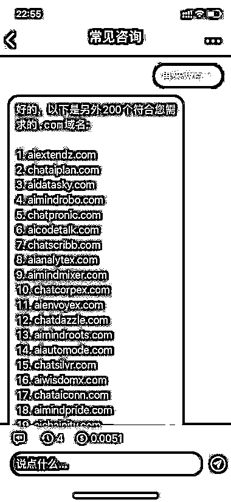

# 利用 ChatGPT 辅助注册域名

> 原文：[`www.yuque.com/for_lazy/xkrm14/uocibcgk9xxgp23h`](https://www.yuque.com/for_lazy/xkrm14/uocibcgk9xxgp23h)

作者： 大仙

日期：2023-03-28

点赞数：43

正文：

【利用 chatGPT 辅助注册域名】 昨天想要注册域名，想到可以让 chatGPT 作为辅助，于是向 chatGPT 提问了：chat 或者 ai 相关的域名有哪些没有被注册的，要求简单好记，最后后缀是 com 或者 cn 或者 net，请列举 100 个可以注册的相关域名。 很快 chatGPT 就给我一百个域名选择， 因为 3.5 版本信息滞后用的是 2021 年 9 月之前的数据，有些是已经被注册的，有些可以注册，看不是很满意就再要求 chatGPT 再来两百个，迅速 chatGPT 又给了我两百个域名可以参考注册。 如果利用 GPT4 模型再加上实时联网插件，完全可以实现精准域名批量注册，有价值的域名是唯一资源，几十元投资注册的域名网站，可以转手卖几千几万甚至几十万（前提是域名优质好记最好是 com 或者 cn 或者 net 后缀，还要有人愿意高价收），做域名注册投资的圈友可以卷起来。

  

  

  

  

评论区：

陈星空 : 前面刚注册了一些域名[捂脸]

光追 20220908 : 域名注册商可乐坏了啊

大仙 : 现在各个平台有打击 chatGPT 的势头，chatGPT 做独立网站成本也不高，还能活得久一些，可以尝试。

公众号懒人找资源，懒人专属群分享

