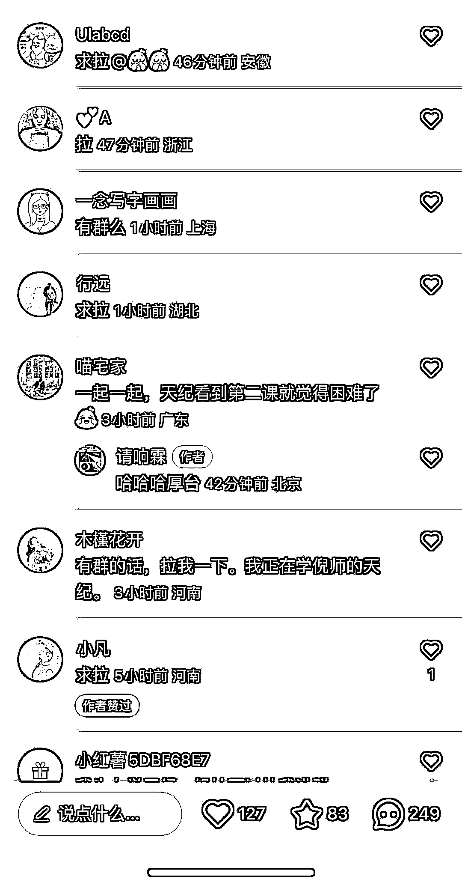

# 小红书类似一起学 ChatGPT 的评论可以引流

> 原文：[`www.yuque.com/for_lazy/xkrm14/dazs2vqcpkbzxgcq`](https://www.yuque.com/for_lazy/xkrm14/dazs2vqcpkbzxgcq)

作者： hepingfly

日期：2023-03-28

点赞数：37

<ne-card data-card-name="hr" data-card-type="block" id="IXOwV" data-event-boundary="card">

正文：

类似的，有没有一起学 chatgpt 的，有没有一起考研的 底下都是一堆求拉

<ne-card data-card-name="image" data-card-type="inline" id="qfI4C" data-event-boundary="card">  <ne-p id="u9de8d37b" data-lake-id="u9de8d37b"><ne-card data-card-name="image" data-card-type="inline" id="HMLmd" data-event-boundary="card">  <ne-card data-card-name="hr" data-card-type="block" id="SOO65" data-event-boundary="card"><ne-p id="ua2d92487" data-lake-id="ua2d92487">评论区：

济南张亮（手机卡） : 小红书同理 引流嗖嗖的

<ne-card data-card-name="hr" data-card-type="block" id="x1mhE" data-event-boundary="card">

公众号懒人找资源，懒人专属群分享

</ne-card></ne-card></ne-card></ne-p></ne-card></ne-p></ne-card>