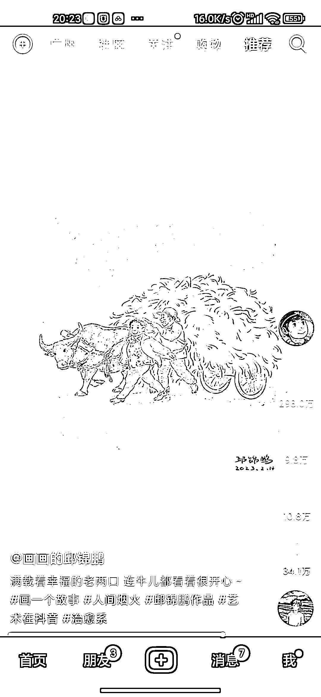
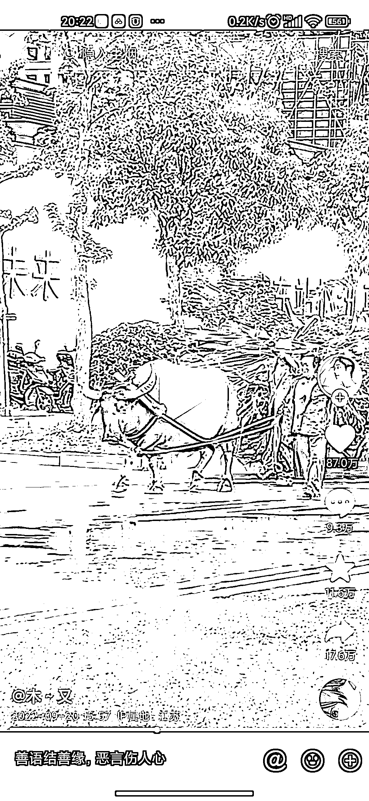

# 抖音利用 chatgpt 二次创作动漫画

> 原文：[`www.yuque.com/for_lazy/xkrm14/ydokf2ohqsu9tpx4`](https://www.yuque.com/for_lazy/xkrm14/ydokf2ohqsu9tpx4)

作者： 阿道无货源店群

日期：2023-03-28

点赞数：45

正文：

抖音刷到一个画画的百万博主，选题主要是一些已经很火的市井题材，像下面这个赶牛的农民视频，本身原视频已经 100 多万了，只是二次创作一下。 通过 chat GPT 很容易生成类似这种东华效果，可以选取近期或者之前很火的视频素材，然后也这样子创作，火过的东西还会重复火。

  

  

评论区：

地铁馒头 : 用什么软件可以实现这个效果呢

阿道无货源店群 : 这个可以去找找，很多的这种软件

阿道无货源店群 : 第二条中标了，只要持续分享自己看到的东西，经常写，中标也不难，毕竟每个人经历不一样，从事领域不一样，即使同一个事物也能会看到不一样的东西

公众号懒人找资源，懒人专属群分享

