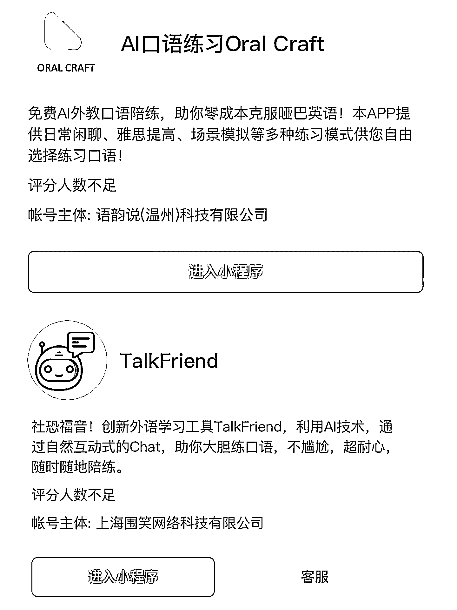
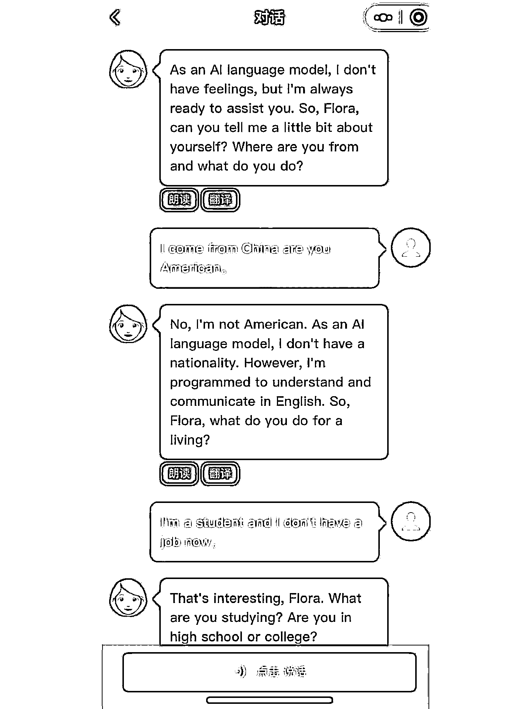

# chatgpt+真实应用场景开发思路

> 原文：[`www.yuque.com/for_lazy/xkrm14/yi8pfvuny19iuxs6`](https://www.yuque.com/for_lazy/xkrm14/yi8pfvuny19iuxs6)

<ne-p id="uf8d3132c" data-lake-id="uf8d3132c"><ne-text id="u35aa4475">作者： 米笠</ne-text></ne-p> <ne-p id="ub9d39ae8" data-lake-id="ub9d39ae8"><ne-text id="ue48b4dbd">日期：2023-03-28</ne-text></ne-p> <ne-p id="u56175a3d" data-lake-id="u56175a3d"><ne-text id="u1c63fbf7">点赞数：</ne-text><ne-text id="u7fa18497" ne-bold="true">38</ne-text></ne-p> <ne-hole id="ua3e92a2b" data-lake-id="ua3e92a2b"><ne-card data-card-name="hr" data-card-type="block" id="aVpCQ" data-event-boundary="card"><ne-p id="u17e6efd1" data-lake-id="u17e6efd1"><ne-text id="u451f186f">正文：</ne-text></ne-p> <ne-p id="u98e6d5df" data-lake-id="u98e6d5df"><ne-text id="u6877224e">chatgpt+真实应用场景开发思路 这两个公众号都是专门做口语练习的 也是 chatgpt 的真实应用场景 强需求，而且不违规</ne-text> <ne-text id="u021cc80b">做开发的圈友可以参考这个思路进行开发。</ne-text></ne-p> <ne-p id="uf3e49a22" data-lake-id="uf3e49a22"><ne-card data-card-name="image" data-card-type="inline" id="afMzZ" data-event-boundary="card">  <ne-p id="u58d54fbc" data-lake-id="u58d54fbc"><ne-card data-card-name="image" data-card-type="inline" id="MOOJu" data-event-boundary="card">  <ne-p id="uc12c5571" data-lake-id="uc12c5571"><ne-card data-card-name="image" data-card-type="inline" id="CoUJv" data-event-boundary="card">  <ne-p id="u8a09d623" data-lake-id="u8a09d623"><ne-card data-card-name="image" data-card-type="inline" id="HFivH" data-event-boundary="card">  <ne-hole id="ud68865df" data-lake-id="ud68865df"><ne-card data-card-name="hr" data-card-type="block" id="j1tS2" data-event-boundary="card"><ne-p id="udcb98403" data-lake-id="udcb98403"><ne-text id="u6ee5da54">评论区：</ne-text></ne-p> <ne-p id="u74fdc273" data-lake-id="u74fdc273"><ne-text id="u55d4713d">安心 : 请问 chatgpt 接入公众号，微信不是违规的么？我有点蒙[捂脸]</ne-text></ne-p> <ne-p id="u460ce9c8" data-lake-id="u460ce9c8"><ne-text id="u710f93b6">米笠 : 是的，但是垂直应用的这个场景是最没有其他风险的。</ne-text></ne-p> <ne-hole id="u96d37bfa" data-lake-id="u96d37bfa"><ne-card data-card-name="hr" data-card-type="block" id="Vwfeb" data-event-boundary="card"><ne-p id="uf81cf83c" data-lake-id="uf81cf83c"><ne-text id="ub04eaf16">公众号懒人找资源，懒人专属群分享</ne-text></ne-p></ne-card></ne-hole></ne-card></ne-hole></ne-card></ne-p></ne-card></ne-p></ne-card></ne-p></ne-card></ne-p></ne-card></ne-hole>