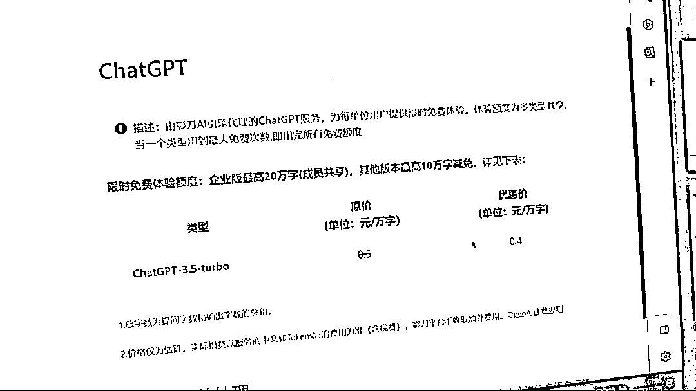

# 影刀 rpa 接入了 ChatGPT3.5

> 原文：[`www.yuque.com/for_lazy/xkrm14/zt03ma0p96zdas39`](https://www.yuque.com/for_lazy/xkrm14/zt03ma0p96zdas39)

作者： 我来

日期：2023-03-28

点赞数：22

<ne-card data-card-name="hr" data-card-type="block" id="j6SEQ" data-event-boundary="card">

正文：

影刀 rpa 接入了 ChatGPT3.5，有 10w 字的额度，可充值。 对很多使用 rpa 的朋友是个福音，可直接使用，可连续多轮对话。 需要先更新然后才能使用。

<ne-card data-card-name="image" data-card-type="inline" id="YcWW2" data-event-boundary="card">  <ne-p id="u20d0fa58" data-lake-id="u20d0fa58"><ne-card data-card-name="image" data-card-type="inline" id="MyMfw" data-event-boundary="card">  <ne-card data-card-name="hr" data-card-type="block" id="eUyG8" data-event-boundary="card"><ne-p id="uf6dba78e" data-lake-id="uf6dba78e">评论区：

David : 不会过滤关键字？

<ne-card data-card-name="hr" data-card-type="block" id="IAHmQ" data-event-boundary="card">

公众号懒人找资源，懒人专属群分享

</ne-card></ne-card></ne-card></ne-p></ne-card></ne-p></ne-card>