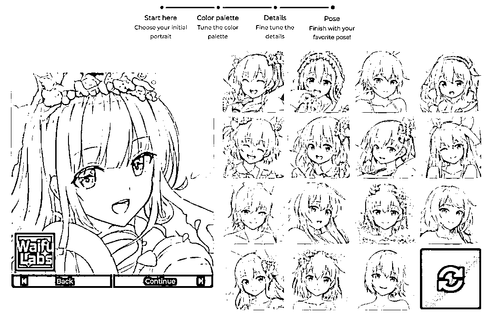

# 麻省理工大学的 sizigi 工作室制作的一款 AI 工具：动漫肖像魔法

> 原文：[`www.yuque.com/for_lazy/xkrm14/ekhv709yo2v7c58g`](https://www.yuque.com/for_lazy/xkrm14/ekhv709yo2v7c58g)

作者： 不期而遇

日期：2023-03-28

点赞数：20

正文：

麻省理工大学的 sizigi 工作室制作的一款 AI 工具：动漫肖像魔法（Magical Anime Portraits）。 它的主要功能，是能借助机器学习技术，通过持续的绘画风格迁移与转化，快速为你定制一张「二次元肖像图」。 可以通过选择头像、滤镜、风格、动作这 4 个步骤，来定制一个专属的二次元老婆 / 老公图片。 思路：QQ、小红书、B 站、抖音视频号等进行头像引流到公众号/私域进行实现二次元用户头像定制………

  

  

  

  

  

评论区：

不期而遇 : 感谢[玫瑰]

公众号懒人找资源，懒人专属群分享

