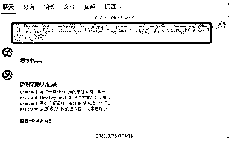
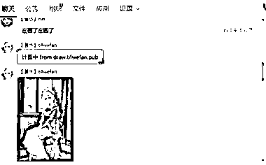
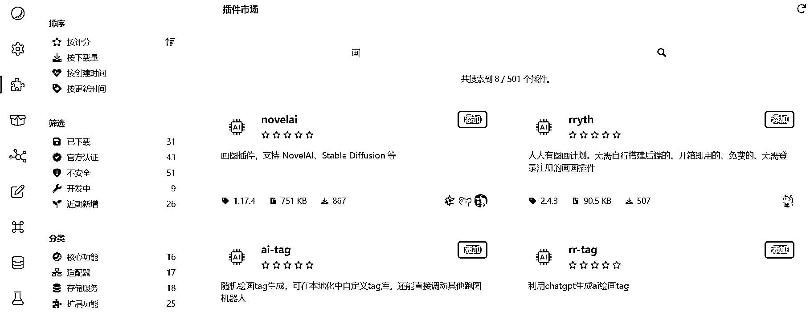
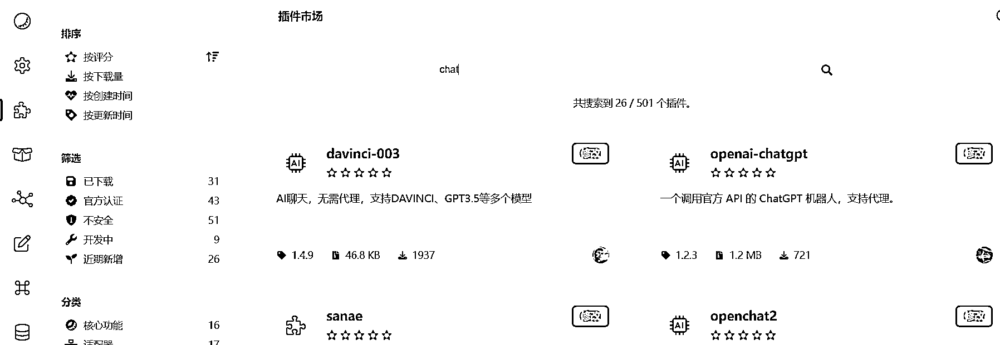

# 借助开源工具 Koishi 可以搭 chatGPT ,几乎 0 费用

> 原文：[`www.yuque.com/for_lazy/xkrm14/yfcchwrhabrp6bz9`](https://www.yuque.com/for_lazy/xkrm14/yfcchwrhabrp6bz9)

作者： 淘气猫

日期：2023-03-27

点赞数：50

正文：

用 chatgpt 引流的需求很大，借助开源工具 Koishi 可以搭 gpt，可以几乎 0 费用 开源工具叫 Koishi，其中提供了 qq、飞书的对接服务，chatgpt 的服务 1、不用写代码，大大降低普通人搭建的门槛 2、可服务器，也可电脑，愿意用 Windows 进行 24 小时服务也可以 3、支持 qq、飞书、discord、kook（微信的也有，但没做好，暂时不推荐） 4、有 chatgpt 官方账号的可以用 davinci 服务，没有账号的可以用 sanae 服务 5、这里还有免费的绘画服务，也可对接 qq 等，目前看到是漫画风为主 劣势： gpt 聊天次数有限制，没办法高频服务 整体使用还是很简化的，如果安装后不会用，官方还有教程、论坛等

  

  

  

  

  

评论区：

飞哥有料 : 聊天次数有限制？这个我没看到有说明

淘气猫 : 免费版不可能无限聊的，用爱发电撑不住呀

飞哥有料 : 你说的免费版是指 koishi 提供的免费账号吧，我以为自己用的免费 chatgpt 账号，这种应该没限制

淘气猫 : [呲牙]那是可以，但官方的经常抽风吧

飞哥有料 : 听这意思第三方比较稳定还？不都是基于官方的吗

星夜 : 我也制作啦一款中文免翻，收会员 8.8 一月 投资啦 30 块 一个服务器😃目前说实话 还可以

淘气猫 : 有自己训练的呀，这个有开源的吧

金九渊 : 就上面这个插件么

公众号懒人找资源，懒人专属群分享

