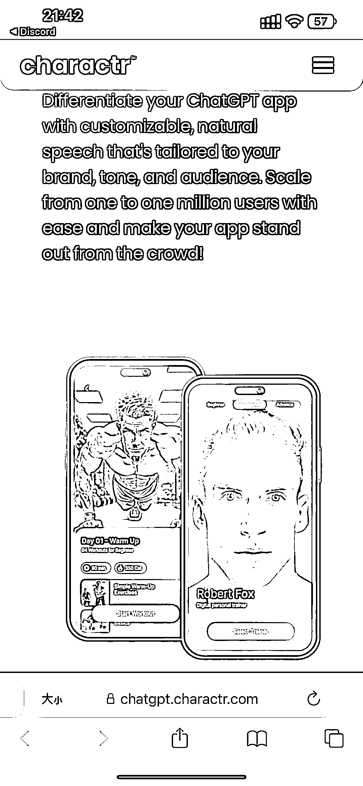

# 专门为 ChatGPT 机器人生成虚拟形象和配音的软件

> 原文：[`www.yuque.com/for_lazy/xkrm14/gpgk9uu4o0zt6mka`](https://www.yuque.com/for_lazy/xkrm14/gpgk9uu4o0zt6mka)

<ne-p id="uf9e2384d" data-lake-id="uf9e2384d"><ne-text id="uc33531d3">作者： 姬小光</ne-text></ne-p> <ne-p id="uaa441c51" data-lake-id="uaa441c51"><ne-text id="u895e5872">日期：2023-03-27</ne-text></ne-p> <ne-p id="u000b7b05" data-lake-id="u000b7b05"><ne-text id="uec935c85">点赞数：</ne-text><ne-text id="u7398f5da" ne-bold="true">47</ne-text></ne-p> <ne-hole id="u2f1e5ca0" data-lake-id="u2f1e5ca0"><ne-card data-card-name="hr" data-card-type="block" id="v0zUV" data-event-boundary="card"><ne-p id="u754a751d" data-lake-id="u754a751d"><ne-text id="ua0030e89">正文：</ne-text></ne-p> <ne-p id="u4b573832" data-lake-id="u4b573832"><ne-text id="u495a0878">专门为 ChatGPT 机器人生成虚拟形象和配音的软件和 api ,目前免费</ne-text> [<ne-text id="u8ece3e7e">charactr+-+Generative+AI+platform+&+API</ne-text>](https://chatgpt.charactr.com)</ne-p> <ne-p id="u3f827aaf" data-lake-id="u3f827aaf"><ne-card data-card-name="image" data-card-type="inline" id="a7hdU" data-event-boundary="card"></ne-card></ne-p> <ne-p id="u79b1384b" data-lake-id="u79b1384b"><ne-card data-card-name="image" data-card-type="inline" id="vVk9t" data-event-boundary="card"></ne-card></ne-p> <ne-hole id="u600a03a3" data-lake-id="u600a03a3"><ne-card data-card-name="hr" data-card-type="block" id="wX5fY" data-event-boundary="card"><ne-p id="u59e7b449" data-lake-id="u59e7b449"><ne-text id="ua62e952e">评论区：</ne-text></ne-p> <ne-hole id="u86005f97" data-lake-id="u86005f97"><ne-card data-card-name="hr" data-card-type="block" id="DZd9V" data-event-boundary="card"><ne-p id="u119ad35e" data-lake-id="u119ad35e"><ne-text id="ud6fc4a8c">公众号懒人找资源，懒人专属群分享</ne-text></ne-p></ne-card></ne-hole></ne-card></ne-hole></ne-card></ne-hole>