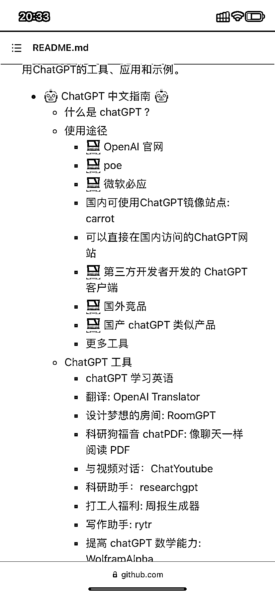

# GitHub 上 收集了各种免费和付费的 ChatGPT 资源

> 原文：[`www.yuque.com/for_lazy/xkrm14/ullobuyqztqc1pb2`](https://www.yuque.com/for_lazy/xkrm14/ullobuyqztqc1pb2)

作者： 大头

日期：2023-03-27

点赞数：50

<ne-card data-card-name="hr" data-card-type="block" id="WNjjs" data-event-boundary="card">

正文：

发现了 GitHub 上一个 ChatGPT 一个不错的资源 收集了各种免费和付费的 ChatGPT 资源，以及如何更有效地与 ChatGPT 进行交流的方法。 [GitHub+-+yzfly/awesome-chatgpt-zh:+ChatGPT+中文指南，指令...](https://github.com/yzfly/awesome-chatgpt-zh)

<ne-card data-card-name="image" data-card-type="inline" id="sZkfH" data-event-boundary="card">  <ne-card data-card-name="hr" data-card-type="block" id="NQKaQ" data-event-boundary="card"><ne-p id="ua2ce8710" data-lake-id="ua2ce8710">评论区：

<ne-card data-card-name="hr" data-card-type="block" id="ZWgsK" data-event-boundary="card">

公众号懒人找资源，懒人专属群分享

</ne-card></ne-card></ne-card></ne-p></ne-card>