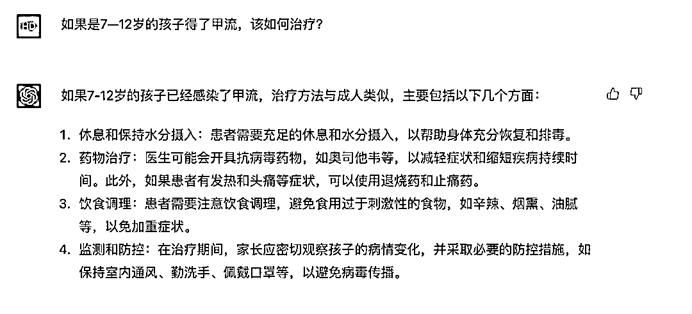
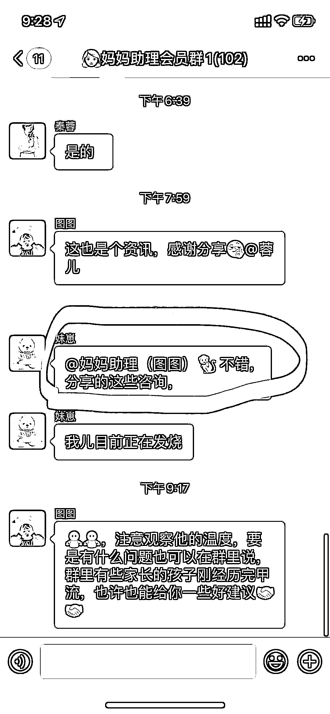

# 用 chatgpt 解决实际问题的应用场景

> 原文：[`www.yuque.com/for_lazy/xkrm14/cz8uocae1m10x7m7`](https://www.yuque.com/for_lazy/xkrm14/cz8uocae1m10x7m7)

作者： 韩丹

日期：2023-03-27

点赞数：35

正文：

最近小孩子得甲流的很多，然后用 chatgpt 给一个妈妈社群做了分享。反馈还不错。 对于客户来说，她们不在乎如何使用 AI，他们只在乎如何解决她们的问题。 这也许就是机会吧。

  

  

  

评论区：

黄小刀🔪 : 对于客户来说，她们不在乎如何使用 AI，他们只在乎如何解决她们的问题。——金句

公众号懒人找资源，懒人专属群分享

