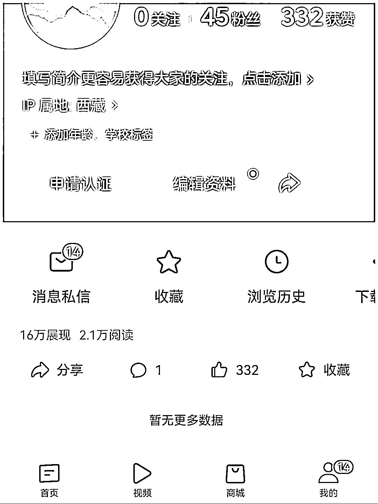

# 用 chat GPT 写了文章，发微头条

> 原文：[`www.yuque.com/for_lazy/xkrm14/dabg56v58yl1fvc3`](https://www.yuque.com/for_lazy/xkrm14/dabg56v58yl1fvc3)

作者： 云珞 YunL

日期：2023-03-27

点赞数：27

<ne-card data-card-name="hr" data-card-type="block" id="UKyje" data-event-boundary="card">

正文：

ai 写作大有可为 昨天用 chat GPT 写了文章，发微头条。 明明普普通通，却有 2 万阅读量

<ne-card data-card-name="image" data-card-type="inline" id="z9D0R" data-event-boundary="card">  <ne-card data-card-name="hr" data-card-type="block" id="mYMf7" data-event-boundary="card"><ne-p id="udf7fd03c" data-lake-id="udf7fd03c">评论区：

虚无的吴 : 写的是什么类型的文章啊

云珞 YunL : 情感故事文

<ne-card data-card-name="hr" data-card-type="block" id="xgzIZ" data-event-boundary="card">

公众号懒人找资源，懒人专属群分享

</ne-card></ne-card></ne-card></ne-p></ne-card>