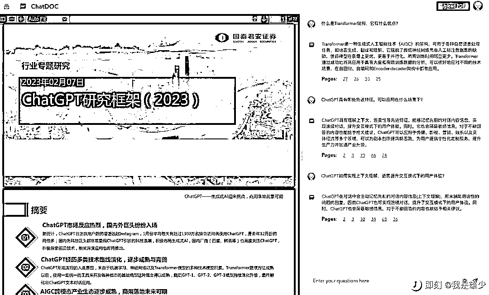

# ChatDOC 是一个基于 ChatGPT 的文件阅读助手

> 原文：[`www.yuque.com/for_lazy/xkrm14/ohl853wd6vwpf6q2`](https://www.yuque.com/for_lazy/xkrm14/ohl853wd6vwpf6q2)

作者： TF 四夕

日期：2023-03-27

点赞数：22

<ne-card data-card-name="hr" data-card-type="block" id="WW6M6" data-event-boundary="card">

正文：

发现一个读 PDF 的好工具，又快又免费。ChatDOC 是一个基于 ChatGPT 的文件阅读助手，可以快速从 PDF 文档中提取、定位和汇总文件信息。你可以上传研究论文、书籍、手册等文件，然后通过聊天的方式向 ChatDOC 提问，获取简洁易懂的回答。ChatDOC 还可以理解文档中的表格或文字，优化其数据分析性能，并为每个回答提供直接引用的来源，方便您核实 AI 的解读准确性。ChatDOC 支持中英文，并且免费注册。[ChatDOC](https://chatdoc.com/chatdoc/#/upload)

<ne-card data-card-name="image" data-card-type="inline" id="J6ts3" data-event-boundary="card">  <ne-p id="ub1bcb379" data-lake-id="ub1bcb379"><ne-card data-card-name="image" data-card-type="inline" id="yOS8S" data-event-boundary="card">  <ne-card data-card-name="hr" data-card-type="block" id="yM19g" data-event-boundary="card"><ne-p id="u0059b9cb" data-lake-id="u0059b9cb">评论区：

暂无评论

<ne-card data-card-name="hr" data-card-type="block" id="NlZSm" data-event-boundary="card">

公众号懒人找资源，懒人专属群分享

</ne-card></ne-card></ne-card></ne-p></ne-card></ne-p></ne-card>