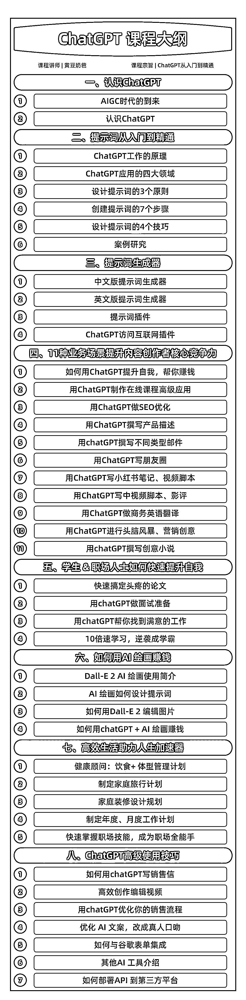

# ChatGPT 掘金，做一份专注垂直领域的课

> 原文：[`www.yuque.com/for_lazy/xkrm14/lv57o55yxhpb03ld`](https://www.yuque.com/for_lazy/xkrm14/lv57o55yxhpb03ld)

<ne-p id="ub522a4e2" data-lake-id="ub522a4e2"><ne-text id="u0e339988">作者： 树正</ne-text></ne-p> <ne-p id="u984c6fcb" data-lake-id="u984c6fcb"><ne-text id="u00e369cc">日期：2023-03-27</ne-text></ne-p> <ne-p id="ud75b0b1a" data-lake-id="ud75b0b1a"><ne-text id="ud24e5cc9">点赞数：</ne-text><ne-text id="u658f745d" ne-bold="true">30</ne-text></ne-p> <ne-hole id="u2550abad" data-lake-id="u2550abad"><ne-card data-card-name="hr" data-card-type="block" id="iEQi4" data-event-boundary="card"><ne-p id="u709f05a9" data-lake-id="u709f05a9"><ne-text id="u1c658c3f">正文：</ne-text></ne-p> <ne-p id="u2b5e148e" data-lake-id="u2b5e148e"><ne-text id="u92e1f996">大多数朋友想赶 chatgpt 这波风潮，一个典型的变现产品选择就是做一门课，一门大而全的课 我觉得可以掘金的一点是，反其道而行之，做一份专注垂直领域的课。</ne-text> <ne-text id="u41d6513c">举个例子，你可以做一门专门解决保险从业者的 chatgpt 课程，教他们怎么降本增效。</ne-text> <ne-text id="u8f2d5aa2">你可以做一门专门解决健身从业者的 chatgpt 课程，或者做一门专门解决 hr 人员管理的 chatgpt 课程。</ne-text> <ne-text id="uc2b7cdbb">这样的课程并没有想象的那么难，因为大而全的课程在市面已经有了。你要做的就是找到一个垂直领域，把 chatgpt 在这个领域可以怎么更好的应用给搞出来。</ne-text> <ne-text id="uc00ec0ea">对于一个垂直领域的人来说，相比于购买大而全的课程，他肯定更愿意购买垂直领域的课程，因为你说的东西，你讲的应用场景是他现实生活中正在经历的。</ne-text> <ne-text id="uc5a8b48a">而且还有一个好处是，如果你成为了该垂直领域的 chatgpt 大神，之后会有很多商业机会，商业资源。相当于，别的大佬积累若干年才得到的资源，你可以用 chatgpt 来弯道超车，成为行业 kol</ne-text> <ne-text id="u520c0ed2">推荐圈友们试一试，避开大而全，选择垂直领域+chatgpt，成为你所在的垂直领域里最懂 chatgpt 的人，成为大家一想到有问题想解决第一时间会想到你的人</ne-text></ne-p> <ne-p id="ue99b00eb" data-lake-id="ue99b00eb"><ne-card data-card-name="image" data-card-type="inline" id="VmzbS" data-event-boundary="card"></ne-card></ne-p> <ne-hole id="u767ee0fb" data-lake-id="u767ee0fb"><ne-card data-card-name="hr" data-card-type="block" id="SWrIb" data-event-boundary="card"><ne-p id="ua7ab0ed0" data-lake-id="ua7ab0ed0"><ne-text id="udda6676d">评论区：</ne-text></ne-p> <ne-p id="ubfd3a0c3" data-lake-id="ubfd3a0c3"><ne-text id="u344924e1">暂无评论</ne-text></ne-p> <ne-hole id="uc9130adc" data-lake-id="uc9130adc"><ne-card data-card-name="hr" data-card-type="block" id="t0uTr" data-event-boundary="card"><ne-p id="uaefa6d01" data-lake-id="uaefa6d01"><ne-text id="uc53c1120">公众号懒人找资源，懒人专属群分享</ne-text></ne-p></ne-card></ne-hole></ne-card></ne-hole></ne-card></ne-hole>