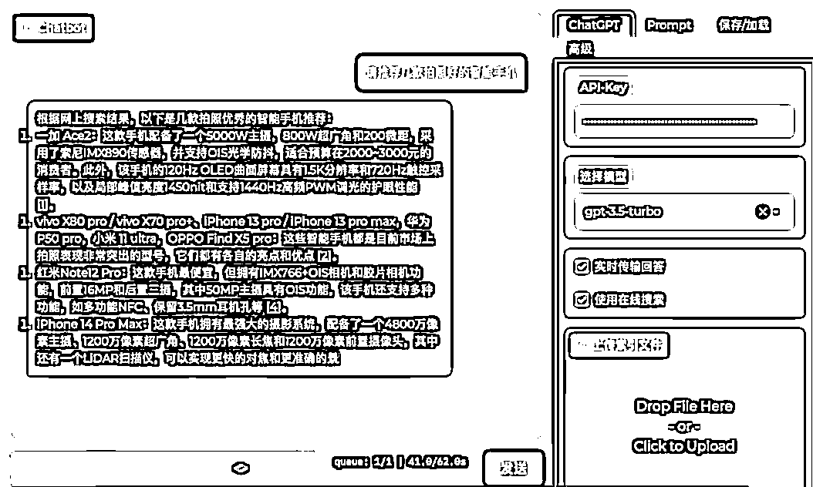

# Github 上发现一个非常好用的 GPT 开源项目，支持自己部署

> 原文：[`www.yuque.com/for_lazy/xkrm14/lzgit951bdfrv41m`](https://www.yuque.com/for_lazy/xkrm14/lzgit951bdfrv41m)

<ne-p id="u63a9eb6f" data-lake-id="u63a9eb6f"><ne-text id="u0c4ca649">作者： 白露听雨</ne-text></ne-p> <ne-p id="u45c24b12" data-lake-id="u45c24b12"><ne-text id="u70e65b60">日期：2023-03-24</ne-text></ne-p> <ne-p id="u4af911af" data-lake-id="u4af911af"><ne-text id="uf0d8678f">点赞数：</ne-text><ne-text id="uaadd1d5e" ne-bold="true">58</ne-text></ne-p> <ne-hole id="u20f70659" data-lake-id="u20f70659"><ne-card data-card-name="hr" data-card-type="block" id="QUvHO" data-event-boundary="card"><ne-p id="u3f641448" data-lake-id="u3f641448"><ne-text id="u0f698e60">正文：</ne-text></ne-p> <ne-p id="ud89bee67" data-lake-id="ud89bee67"><ne-text id="u3d4d5709">github 上发现一个非常好用的 gpt 开源项目，支持自己部署 界面美观 支持描述词预设 支持调用不同的模型 ⭐️支持文件索引 上传文本就能就文本内容进行提问</ne-text> <ne-text id="u29199c26">⭐️支持在线搜索 像 new bing 一样 地址</ne-text> [<ne-text id="u85e114be">GitHub+-+GaiZhenbiao/ChuanhuChatGPT:+GUI+for+ChatG...</ne-text>](https://github.com/GaiZhenbiao/ChuanhuChatGPT)</ne-p> <ne-p id="u4e38f39c" data-lake-id="u4e38f39c"><ne-card data-card-name="image" data-card-type="inline" id="url9D" data-event-boundary="card"></ne-card></ne-p> <ne-p id="u487c912e" data-lake-id="u487c912e"><ne-card data-card-name="image" data-card-type="inline" id="SKGah" data-event-boundary="card"></ne-card></ne-p> <ne-hole id="u02d1c648" data-lake-id="u02d1c648"><ne-card data-card-name="hr" data-card-type="block" id="rehnI" data-event-boundary="card"><ne-p id="u3edde155" data-lake-id="u3edde155"><ne-text id="u8dab8e03">评论区：</ne-text></ne-p> <ne-p id="u63471458" data-lake-id="u63471458"><ne-text id="u3937e2c2">卷 : hello～看了你的贴子，今天试了下，卡在了 API KEY 这一部分，想问下这个 KEY 是从哪可以找到啊，求助～</ne-text></ne-p> <ne-p id="u7039a1dd" data-lake-id="u7039a1dd"><ne-text id="u5875fcdf">白露听雨 : 有 chatgpt 账号就有 api key，圈内应该挺多在卖号的，可以问一下</ne-text></ne-p> <ne-p id="u54d09455" data-lake-id="u54d09455"><ne-text id="u7704ff28">出海 SEO 孔明 : 有没有 nodejs 版本推荐</ne-text></ne-p> <ne-hole id="u1379f77f" data-lake-id="u1379f77f"><ne-card data-card-name="hr" data-card-type="block" id="L0TuK" data-event-boundary="card"><ne-p id="ue26e7604" data-lake-id="ue26e7604"><ne-text id="u78733383">公众号懒人找资源，懒人专属群分享</ne-text></ne-p></ne-card></ne-hole></ne-card></ne-hole></ne-card></ne-hole>