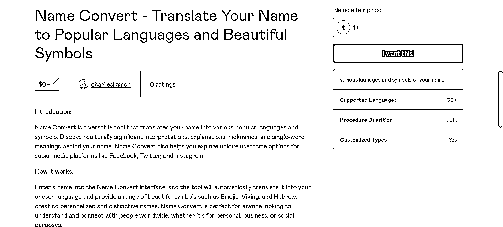
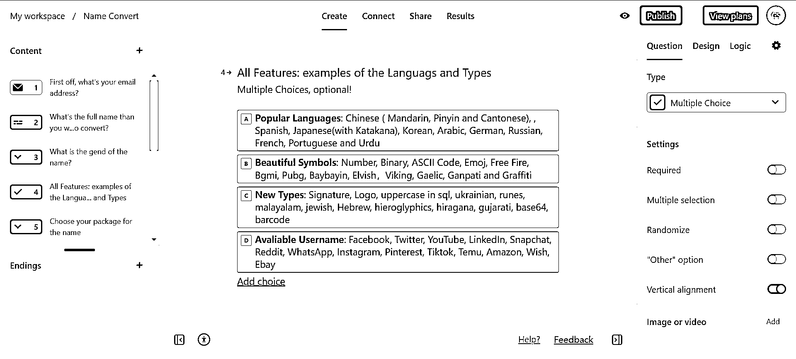

# NAMEBRIDGE 专门给英语国家起中文名字

> 原文：[`www.yuque.com/for_lazy/xkrm14/dhd0dn9lgbg0szom`](https://www.yuque.com/for_lazy/xkrm14/dhd0dn9lgbg0szom)

<ne-p id="u6772b432" data-lake-id="u6772b432"><ne-text id="u05967a85">作者： 良辰美</ne-text></ne-p> <ne-p id="u4610cba2" data-lake-id="u4610cba2"><ne-text id="u357cc4e5">日期：2023-03-24</ne-text></ne-p> <ne-p id="u487cce7c" data-lake-id="u487cce7c"><ne-text id="u08086ad7">点赞数：</ne-text><ne-text id="u7ca65dcd" ne-bold="true">27</ne-text></ne-p> <ne-hole id="u7bb43386" data-lake-id="u7bb43386"><ne-card data-card-name="hr" data-card-type="block" id="CEXXU" data-event-boundary="card"><ne-p id="uccb0eae4" data-lake-id="uccb0eae4"><ne-text id="u70104d34">正文：</ne-text></ne-p> <ne-p id="u6347c40c" data-lake-id="u6347c40c"><ne-text id="u0290098e">参考圈友的路径，跟随大家的脚步，做了个起名的虚拟产品，主要是针对海外。</ne-text> <ne-text id="u931b729f">有个华人程序员做了 NAMEBRIDGE 专门给英语国家起中文名字，我这个是可以把取任何你想要的名字：各国语言，符号表情，平台昵称等等。</ne-text> <ne-text id="u6bcac19a">现在刚做好 GUMROAD 的产品落地页，自动化流程还在调试中，域名买了配合落地页和社媒的营销还没来得及做。</ne-text> <ne-text id="uc8283043">最近 ChatGPT 超级大爆发，想多上点海外版和亚马逊专业产品工具，真是有场景有需求就可以通过它无代码实现功能。</ne-text> <ne-text id="uf455eecc">由于是前面工作都是面向海外版的全英文界面，这里就只放飞书的表单吧，感兴趣的圈友可以填免费给你做。</ne-text> [<ne-text id="ud395ae96">问卷标题</ne-text>](https://fs.fanqier.cn/f/n6zphriq)</ne-p> <ne-p id="u8b1a899c" data-lake-id="u8b1a899c"><ne-card data-card-name="image" data-card-type="inline" id="Xr6Oj" data-event-boundary="card">  <ne-p id="u251da842" data-lake-id="u251da842"><ne-card data-card-name="image" data-card-type="inline" id="F3Cjh" data-event-boundary="card">  <ne-p id="u6a3464ea" data-lake-id="u6a3464ea"><ne-card data-card-name="image" data-card-type="inline" id="O3mrL" data-event-boundary="card">  <ne-p id="u73358759" data-lake-id="u73358759"><ne-card data-card-name="image" data-card-type="inline" id="nIxmq" data-event-boundary="card">  <ne-hole id="ub8923bef" data-lake-id="ub8923bef"><ne-card data-card-name="hr" data-card-type="block" id="k6DHQ" data-event-boundary="card"><ne-p id="u4411c010" data-lake-id="u4411c010"><ne-text id="uf6b8dafb">评论区：</ne-text></ne-p> <ne-p id="u6ef96e4a" data-lake-id="u6ef96e4a"><ne-text id="u794744d3">良辰美 : 感谢鱼的沟通和交流，还有陈怀哲和 Fredrich 的生财文章： 鱼通过风向标和 GPT4 做出个性化定制名人来信 陈怀哲通过低代码工具和 GPT4 做产品落地页</ne-text> <ne-text id="u666c46cb">Fredrich 不是程序员也可以通过自动化流程工具提高生产力和变现</ne-text>[<ne-text id="u511f3ebd">利用+GPT4+迅速将想法落地，让创意在半天时间内变成+MVP</ne-text>](https://t.zsxq.com/0ce4hcasx) [<ne-text id="u2a563021">https://t.zsxq.com/0cs8PTDKy</ne-text>](https://t.zsxq.com/0cs8PTDKy) [<ne-text id="u299301a0">https://t.zsxq.com/0cp8zmd0h</ne-text>](https://t.zsxq.com/0cp8zmd0h)</ne-p> <ne-hole id="u8fa76290" data-lake-id="u8fa76290"><ne-card data-card-name="hr" data-card-type="block" id="qmrw2" data-event-boundary="card"><ne-p id="u57f05f5c" data-lake-id="u57f05f5c"><ne-text id="uce070ff5">公众号懒人找资源，懒人专属群分享</ne-text></ne-p></ne-card></ne-hole></ne-card></ne-hole></ne-card></ne-p></ne-card></ne-p></ne-card></ne-p></ne-card></ne-p></ne-card></ne-hole>