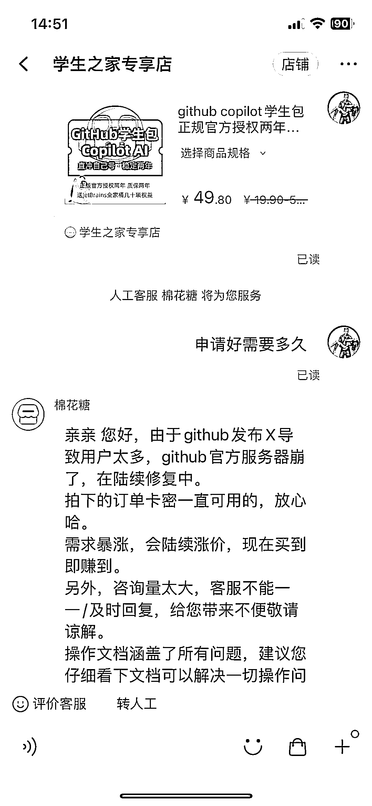

# GitHub 学生包需求量很大 copilot x

> 原文：[`www.yuque.com/for_lazy/xkrm14/ksr6rmudv4e3yue5`](https://www.yuque.com/for_lazy/xkrm14/ksr6rmudv4e3yue5)

作者： Edison

日期：2023-03-24

点赞数：25

<ne-hole id="ub865a206" data-lake-id="ub865a206"><ne-card data-card-name="hr" data-card-type="block" id="mnxjw" data-event-boundary="card">

正文：

GitHub 学生包需求量很大 copilot x

<ne-card data-card-name="image" data-card-type="inline" id="ixKZd" data-event-boundary="card"></ne-card>

<ne-card data-card-name="image" data-card-type="inline" id="sO3AX" data-event-boundary="card"></ne-card>

<ne-hole id="u856b394b" data-lake-id="u856b394b"><ne-card data-card-name="hr" data-card-type="block" id="TZjDP" data-event-boundary="card">

评论区：

暂无评论

<ne-hole id="uf679323a" data-lake-id="uf679323a"><ne-card data-card-name="hr" data-card-type="block" id="rrXYP" data-event-boundary="card">

公众号懒人找资源，懒人专属群分享

</ne-card></ne-hole></ne-card></ne-hole></ne-card></ne-hole>