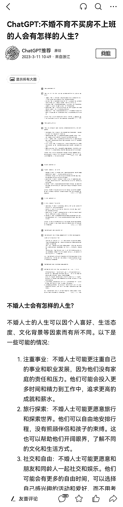
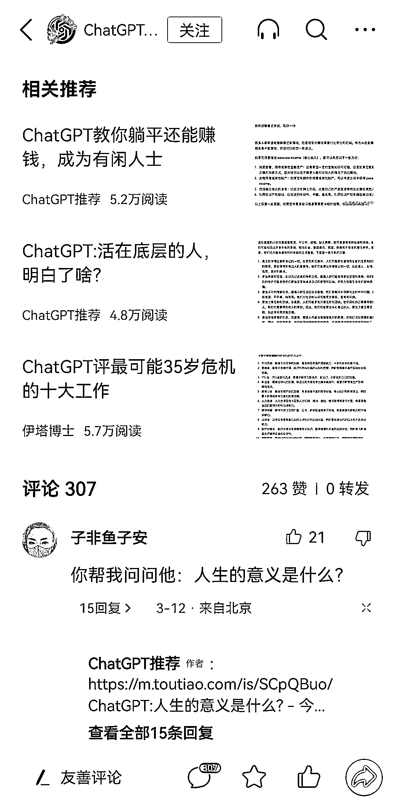

# 通过 ChatGPT 提问在头条号把内容发布成文章，筛选有吸引力的题目

> 原文：[`www.yuque.com/for_lazy/xkrm14/gb1l03n4rpgvozkh`](https://www.yuque.com/for_lazy/xkrm14/gb1l03n4rpgvozkh)

<ne-p id="u40984117" data-lake-id="u40984117"><ne-text id="u425c2156">作者： will</ne-text></ne-p> <ne-p id="udf56d20a" data-lake-id="udf56d20a"><ne-text id="u600b6c6c">日期：2023-03-24</ne-text></ne-p> <ne-p id="u05603168" data-lake-id="u05603168"><ne-text id="u5bc27c85">点赞数：</ne-text><ne-text id="udc05baeb" ne-bold="true">125</ne-text></ne-p> <ne-hole id="u06aab548" data-lake-id="u06aab548"><ne-card data-card-name="hr" data-card-type="block" id="TEsON" data-event-boundary="card"><ne-p id="u0832d33e" data-lake-id="u0832d33e"><ne-text id="u7bd86d30">正文：</ne-text></ne-p> <ne-p id="u01ec52ce" data-lake-id="u01ec52ce"><ne-text id="u872a0639">通过 ChatGPT 提问，在头条号把内容发布成文章，筛选的题目有吸引力，文章标题模板：『ChatGPT:XXXX 问题？』经常出几万到几十万阅读文章，赚取爆文流量收益，爆文还可以多平台同步更新一鱼多吃～</ne-text></ne-p> <ne-p id="ua1c6c162" data-lake-id="ua1c6c162"><ne-card data-card-name="image" data-card-type="inline" id="ToFff" data-event-boundary="card">  <ne-p id="u4355d020" data-lake-id="u4355d020"><ne-card data-card-name="image" data-card-type="inline" id="jnloZ" data-event-boundary="card">  <ne-p id="u624d486c" data-lake-id="u624d486c"><ne-card data-card-name="image" data-card-type="inline" id="zzGg5" data-event-boundary="card">  <ne-p id="u5d2995f1" data-lake-id="u5d2995f1"><ne-card data-card-name="image" data-card-type="inline" id="eOaMi" data-event-boundary="card">  <ne-hole id="ue7760be8" data-lake-id="ue7760be8"><ne-card data-card-name="hr" data-card-type="block" id="lPNl9" data-event-boundary="card"><ne-p id="u2f82e461" data-lake-id="u2f82e461"><ne-text id="ucc225fc4">评论区：</ne-text></ne-p> <ne-p id="ub5f8b97b" data-lake-id="ub5f8b97b"><ne-text id="ue08c63c1">milla_wen : 马上冲去发了一个微头条，晚点来汇报数据[偷笑]</ne-text></ne-p> <ne-p id="ufb8bd7d7" data-lake-id="ufb8bd7d7"><ne-text id="u5fd46a7d">will : [机智]</ne-text></ne-p> <ne-p id="uc84d72c0" data-lake-id="uc84d72c0"><ne-text id="ud7cc9e15">金九渊 : 立马冲</ne-text></ne-p> <ne-p id="ue3386bf9" data-lake-id="ue3386bf9"><ne-text id="u72d4cd83">波叔 : 666</ne-text></ne-p> <ne-p id="u98d93c4f" data-lake-id="u98d93c4f"><ne-text id="u3de1b7ab">小来 : 立马冲！</ne-text></ne-p> <ne-p id="u2dd1c77b" data-lake-id="u2dd1c77b"><ne-text id="udb61188f">陈真 : 这个我也可以冲一波，之前都是把他的回答再加上图片，感觉不如这样的有吸引力。</ne-text></ne-p> <ne-p id="u75ee36c1" data-lake-id="u75ee36c1"><ne-text id="u277c7c93">陈小胖 : 这种方式我在微博试过，有人看，但是不涨粉。</ne-text></ne-p> <ne-p id="u169c8f6a" data-lake-id="u169c8f6a"><ne-text id="u8462e120">大理阿彬 : 刷新了两天了，数据有了没[奸笑]</ne-text></ne-p> <ne-hole id="u24aff62f" data-lake-id="u24aff62f"><ne-card data-card-name="hr" data-card-type="block" id="gSMvH" data-event-boundary="card"><ne-p id="u233d53fb" data-lake-id="u233d53fb"><ne-text id="u4f581c45">公众号懒人找资源，懒人专属群分享</ne-text></ne-p></ne-card></ne-hole></ne-card></ne-hole></ne-card></ne-p></ne-card></ne-p></ne-card></ne-p></ne-card></ne-p></ne-card></ne-hole>