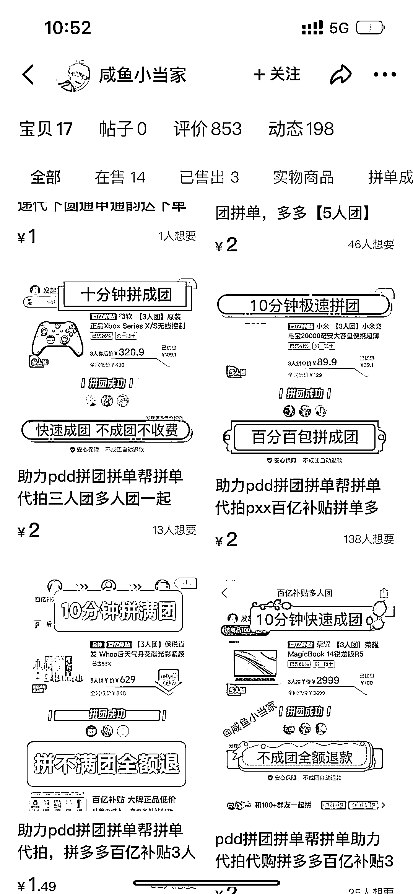
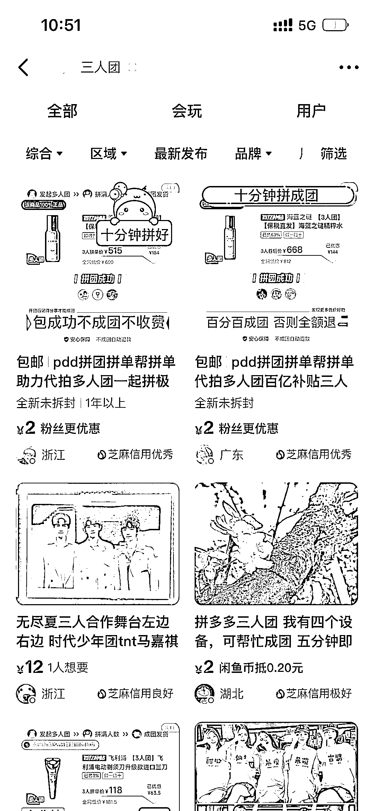
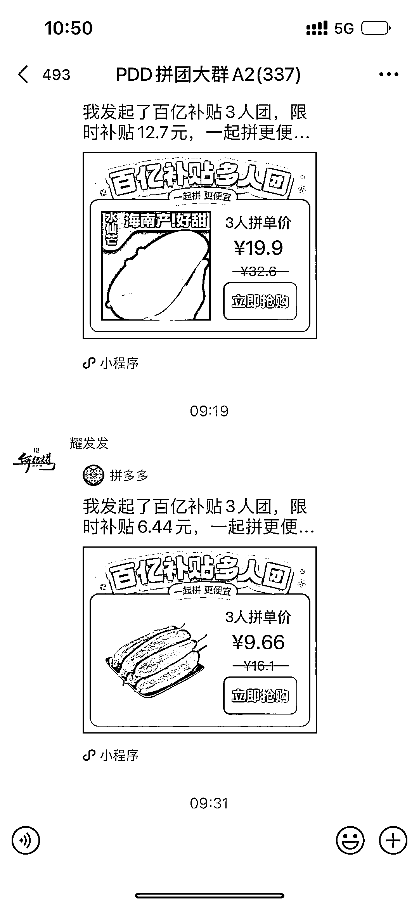
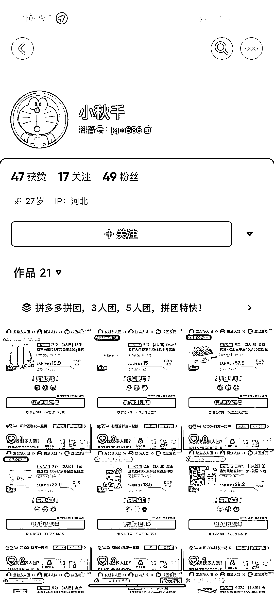

# 抖音 SEO 布局拼多多砍价群，引流效果好

> 原文：[`www.yuque.com/for_lazy/xkrm14/eblyplyfynn8lgvn`](https://www.yuque.com/for_lazy/xkrm14/eblyplyfynn8lgvn)

<ne-text id="u1a29e174">作者： 马克图布</ne-text>

<ne-text id="ud93f1f0d">日期：2023-03-31</ne-text>

<ne-text id="ue2199b72">点赞数：</ne-text><ne-text id="u1e2be6f9" ne-bold="true">29</ne-text>

<ne-hole id="udcc4fac4" data-lake-id="udcc4fac4"><ne-card data-card-name="hr" data-card-type="block" id="aKtiL" data-event-boundary="card">

<ne-text id="u348c3005">正文：</ne-text>

<ne-text id="u200ff391">抖音 seo 布局拼多多砍价群，引流很凶。 之前分享拼多多三人团五人团砍价服务，主要是通过闲鱼流量。现在发现有人在抖音，通过抖音 seo</ne-text> <ne-text id="uaa04e08a">引流方式布局拼多多三人团砍价服务，流量很凶。估计都几百个群了。我进的 65 群。每天不断进人，很凶。结合拼多多的砍价服务，感觉有很大的想象空间。</ne-text>

<ne-card data-card-name="image" data-card-type="inline" id="bQIGX" data-event-boundary="card"></ne-card>

<ne-card data-card-name="image" data-card-type="inline" id="pSJor" data-event-boundary="card"></ne-card>

<ne-card data-card-name="image" data-card-type="inline" id="xaKrg" data-event-boundary="card"></ne-card>

<ne-card data-card-name="image" data-card-type="inline" id="sdfZ6" data-event-boundary="card"></ne-card>

<ne-card data-card-name="image" data-card-type="inline" id="Itvss" data-event-boundary="card"></ne-card>

<ne-card data-card-name="image" data-card-type="inline" id="ADCmW" data-event-boundary="card"></ne-card>

<ne-card data-card-name="image" data-card-type="inline" id="tdxT3" data-event-boundary="card"></ne-card>

<ne-hole id="u43d31aba" data-lake-id="u43d31aba"><ne-card data-card-name="hr" data-card-type="block" id="D5Zkx" data-event-boundary="card">

<ne-text id="ua61c0f67">评论区：</ne-text>

<ne-text id="ue2df118b">辉哥 : 咋变现呢，我之前加了一个，就是不断地发拼多多产品赚返利</ne-text>

<ne-text id="ud0b9a02c">麦芒 : 搜一下关键词，有圈友分享过</ne-text>

<ne-hole id="uf7cd3202" data-lake-id="uf7cd3202"><ne-card data-card-name="hr" data-card-type="block" id="wTesF" data-event-boundary="card">

<ne-text id="ua2712d97">公众号懒人找资源，懒人专属群分享</ne-text>

</ne-card></ne-hole></ne-card></ne-hole></ne-card></ne-hole>