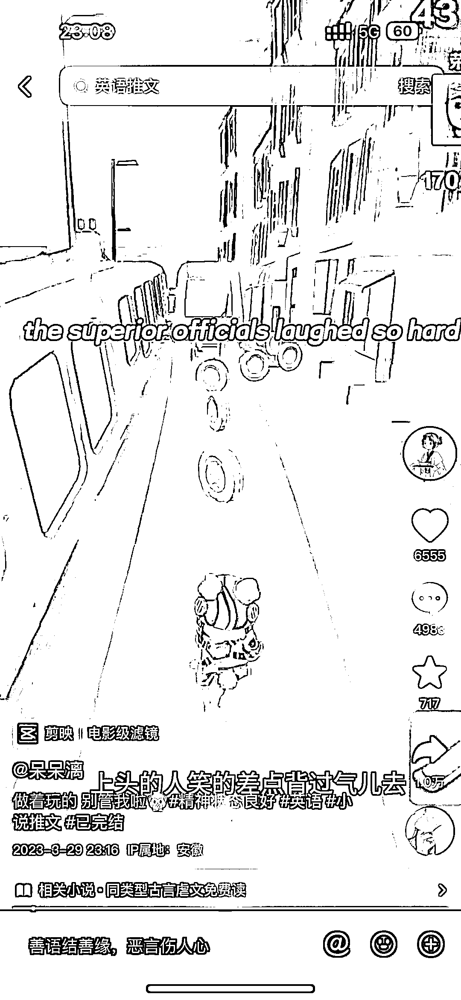

# 抖音：英文版推文，流量火爆

> 原文：[`www.yuque.com/for_lazy/xkrm14/lg6xskh8mu3m33dh`](https://www.yuque.com/for_lazy/xkrm14/lg6xskh8mu3m33dh)

作者： 小赵站在云朵里

日期：2023-03-30

点赞数：23

<ne-card data-card-name="hr" data-card-type="block" id="W2vO3" data-event-boundary="card">

正文：

英文版推文，流量还不错 做推文的可以尝试一波

<ne-card data-card-name="image" data-card-type="inline" id="UV20H" data-event-boundary="card">  <ne-card data-card-name="hr" data-card-type="block" id="JhHjU" data-event-boundary="card"><ne-p id="ub13b2690" data-lake-id="ub13b2690">评论区：

未名 : 关注

幽助 : 小赵，请问怎么联系？

小赵站在云朵里 : ？？？

幽助 : 看到你的视频号航海日志，请问您是如何解决违规就要发 10 条原创，这个问题的？

<ne-card data-card-name="hr" data-card-type="block" id="ln29S" data-event-boundary="card">

公众号懒人找资源，懒人专属群分享

</ne-card></ne-card></ne-card></ne-p></ne-card>