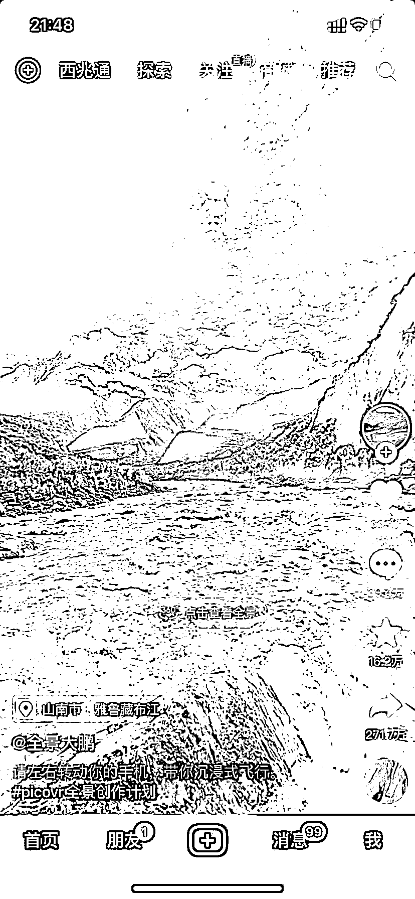

# 抖音：全景视频流量很大

> 原文：[`www.yuque.com/for_lazy/xkrm14/gh3hi2a6rz02701h`](https://www.yuque.com/for_lazy/xkrm14/gh3hi2a6rz02701h)

作者： 大头

日期：2023-03-29

点赞数：40

正文：

抖音刷到一个全景视频 晃动手机，视频视角跟着动，感觉很新鲜，流量很大 然后找到了入口，报名截止时间为 4 月 10 号，活动介绍有奖品和流量扶持，对全景视频有兴趣，可以报个名

  

  

  

  

评论区：

陈小胖 : 这种有没有工具可以做

A 孟世扬 : 是不是需要 360 相机？

陈小胖 : 最好是可以，直接把平面的图片加工成 3D 图

公众号懒人找资源，懒人专属群分享

</ne-p></ne-p></ne-p></ne-p>