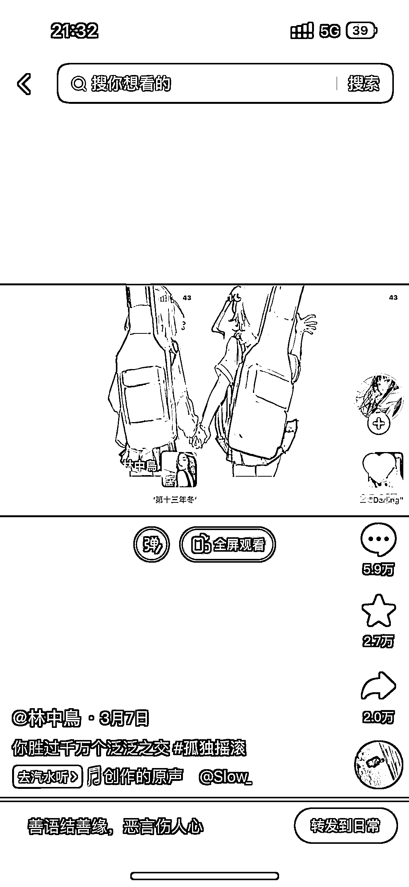
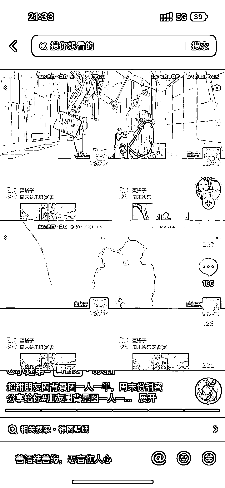

# 抖音图文做双人朋友圈背景，评论量都很高

> 原文：[`www.yuque.com/for_lazy/xkrm14/gsbuimf351ufv71r`](https://www.yuque.com/for_lazy/xkrm14/gsbuimf351ufv71r)

作者： 张柯 Ker

日期：2023-03-28

点赞数：38

<ne-card data-card-name="hr" data-card-type="block" id="dIDck" data-event-boundary="card">

正文：

双人朋友圈背景，评论量都很高

<ne-card data-card-name="image" data-card-type="inline" id="NHx7g" data-event-boundary="card">  <ne-p id="uc001fb8d" data-lake-id="uc001fb8d"><ne-card data-card-name="image" data-card-type="inline" id="LgN8p" data-event-boundary="card">  <ne-p id="ua7f42095" data-lake-id="ua7f42095"><ne-card data-card-name="image" data-card-type="inline" id="D7o15" data-event-boundary="card">  <ne-card data-card-name="hr" data-card-type="block" id="stslg" data-event-boundary="card"><ne-p id="uaf818047" data-lake-id="uaf818047">评论区：

<ne-card data-card-name="hr" data-card-type="block" id="QCeBm" data-event-boundary="card">

公众号懒人找资源，懒人专属群分享

</ne-card></ne-card></ne-card></ne-p></ne-card></ne-p></ne-card></ne-p></ne-card>