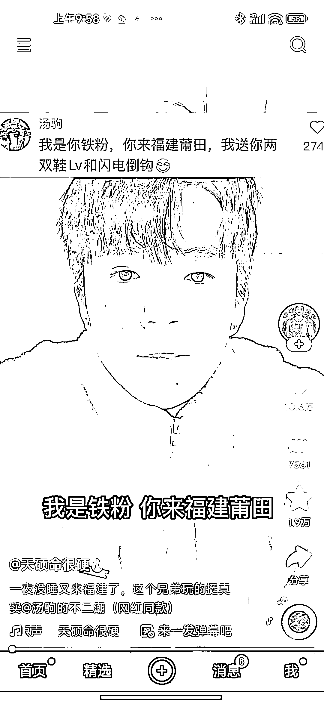
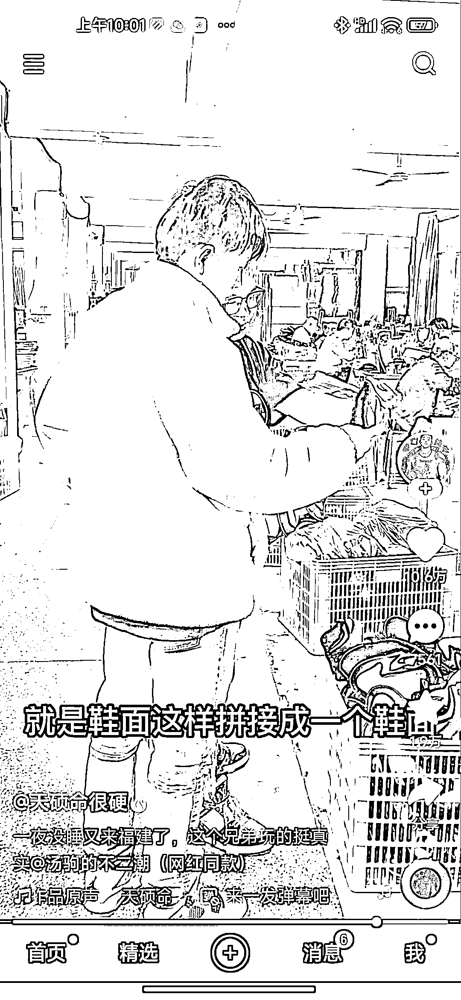
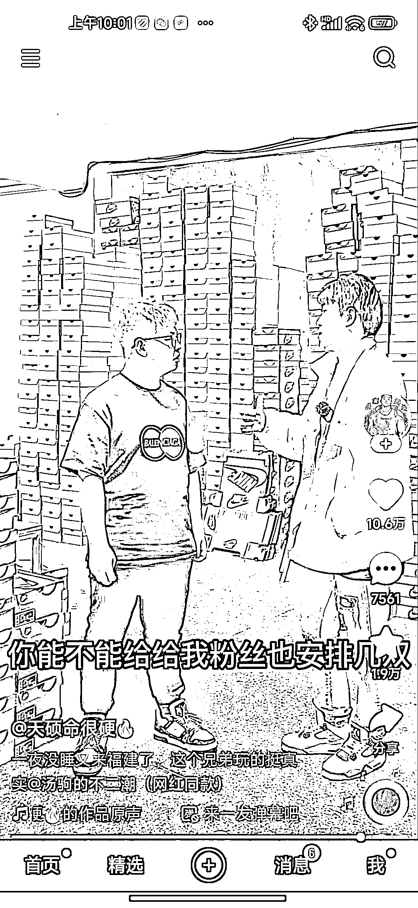

# 抖音挑战系列视频，可以给其他博主导流

> 原文：[`www.yuque.com/for_lazy/xkrm14/kfs70ctdw9plhkkq`](https://www.yuque.com/for_lazy/xkrm14/kfs70ctdw9plhkkq)

作者： 进哥哥@美呗医美合伙*

日期：2023-03-28

点赞数：20

<ne-hole id="ud2815b02" data-lake-id="ud2815b02"><ne-card data-card-name="hr" data-card-type="block" id="BlnTd" data-event-boundary="card">

正文：

快手抖音接单变现新思路 博主以挑战的形式引导开局，为了 2 双鞋子跑到莆田，后面明眼人一看就懂这是给卖鞋的做广告，而且强引导给对方导流，就是不知道一条这样的变现广告多少钱。 引申一下这种是不是可以本地探店形式：挑战鬼屋，挑战特殊美食，巴拉巴拉， 这应该算是刷礼物延长直播时间的变种形式，玩法很多，圈友可以根据自己的产品来结合玩。

<ne-card data-card-name="image" data-card-type="inline" id="PLvWU" data-event-boundary="card"></ne-card>

<ne-card data-card-name="image" data-card-type="inline" id="iJAyP" data-event-boundary="card"></ne-card>

<ne-card data-card-name="image" data-card-type="inline" id="l51VR" data-event-boundary="card">  <ne-p id="u375f308a" data-lake-id="u375f308a"><ne-card data-card-name="image" data-card-type="inline" id="TDinF" data-event-boundary="card"></ne-card>

<ne-card data-card-name="image" data-card-type="inline" id="VeUU4" data-event-boundary="card"></ne-card>

<ne-card data-card-name="image" data-card-type="inline" id="GFROZ" data-event-boundary="card"></ne-card>

<ne-hole id="uffded481" data-lake-id="uffded481"><ne-card data-card-name="hr" data-card-type="block" id="KkhuD" data-event-boundary="card">

评论区：

<ne-hole id="u2cb9f75c" data-lake-id="u2cb9f75c"><ne-card data-card-name="hr" data-card-type="block" id="Onrvj" data-event-boundary="card">

公众号懒人找资源，懒人专属群分享

</ne-card></ne-hole></ne-card></ne-hole></ne-card></ne-p></ne-card></ne-hole>