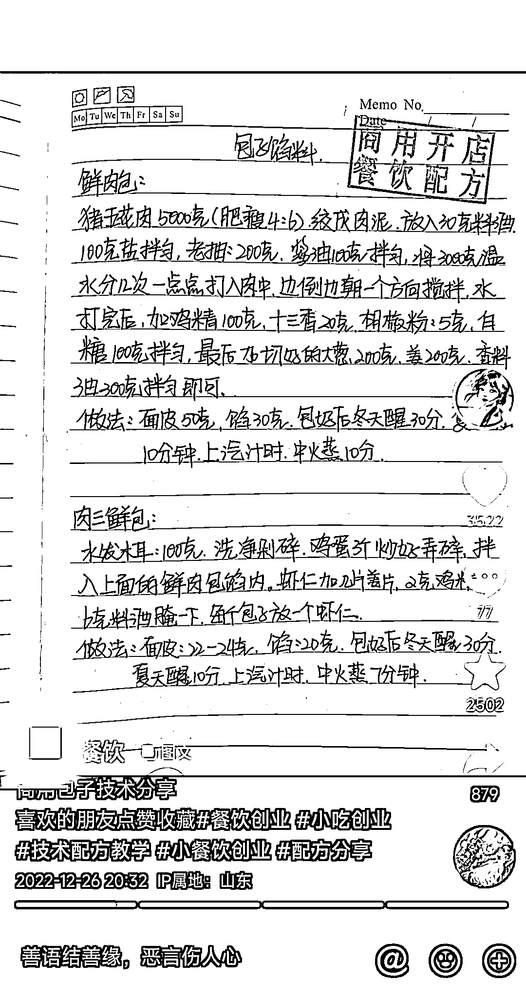

# 抖音手抄菜谱配方视频，可引流变现

> 原文：[`www.yuque.com/for_lazy/xkrm14/xf6w38rxy7r989f9`](https://www.yuque.com/for_lazy/xkrm14/xf6w38rxy7r989f9)

作者： Jay

日期：2023-03-27

点赞数：16

<ne-hole id="u4b06c753" data-lake-id="u4b06c753"><ne-card data-card-name="hr" data-card-type="block" id="QOEu5" data-event-boundary="card">

正文：

手抄菜谱配方，盖个商用开店餐饮配方的印章，每天开直播，就是翻这本手抄菜谱，会引导加粉丝群，钩子是更多配方资料，网盘的资料上再引导加微信，进一步卖更贵视频的课程，再进一步也可以供应原材料和餐饮加盟

<ne-card data-card-name="image" data-card-type="inline" id="kTtLx" data-event-boundary="card"></ne-card>

<ne-hole id="uebcbccee" data-lake-id="uebcbccee"><ne-card data-card-name="hr" data-card-type="block" id="hypQN" data-event-boundary="card">

评论区：

Jay : 谢谢老大！

<ne-hole id="u264941dc" data-lake-id="u264941dc"><ne-card data-card-name="hr" data-card-type="block" id="W65Fk" data-event-boundary="card">

公众号懒人找资源，懒人专属群分享

</ne-card></ne-hole></ne-card></ne-hole></ne-card></ne-hole>