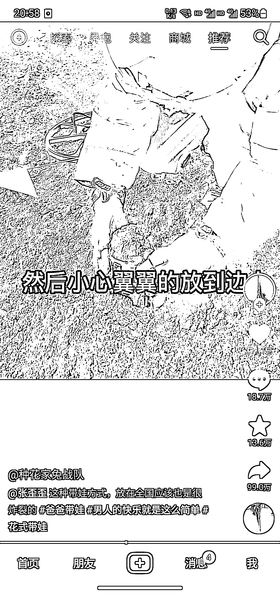
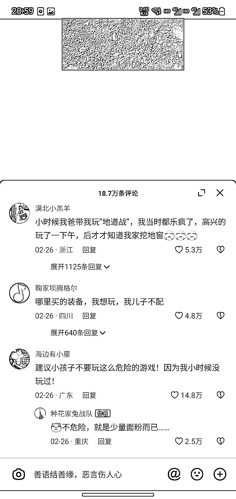
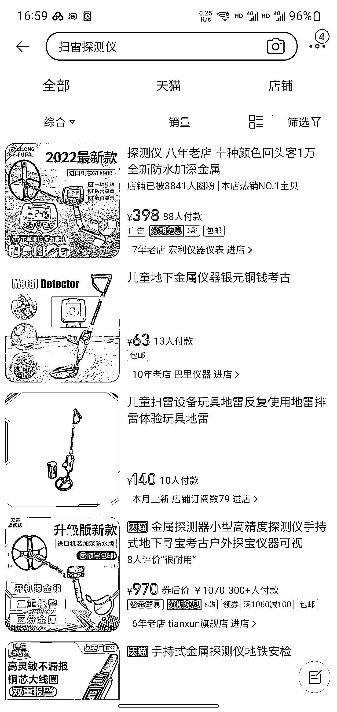

# 抖音儿童玩具项目思路分享

> 原文：[`www.yuque.com/for_lazy/xkrm14/euur1g0lz463i3p8`](https://www.yuque.com/for_lazy/xkrm14/euur1g0lz463i3p8)

作者： 扯淡不打烊

日期：2023-03-27

点赞数：17

<ne-card data-card-name="hr" data-card-type="block" id="D9XT8" data-event-boundary="card">

正文：

抖音刷到的一个父亲带孩子在家玩扫雷项目，两百多万赞，想玩的很多，评论区有一个思路说可以去商场摆摊按次收费，觉得可行。 需求:陪孩子逛街娱乐时，遇到消磨孩子时光的可以解放家长。 可以解决痛点:家里面积不够、玩完还要收拾太麻烦， 一套设备不便宜（图 4 几百—几千） 项目成本:一套设备 项目场地:商场周边、小公园都可以（参照图 2 评论） 项目收费:可以按次数收费，批发点儿童玩具、玩偶，配合奖品挑战（参照图 2 评论）。 项目引流结合线上:加上同城直播，吸引同城流量（参照图 5）

<ne-card data-card-name="image" data-card-type="inline" id="XRQl8" data-event-boundary="card"></ne-card>

<ne-card data-card-name="image" data-card-type="inline" id="iwnmh" data-event-boundary="card"></ne-card>

<ne-card data-card-name="image" data-card-type="inline" id="yVejY" data-event-boundary="card"></ne-card>

<ne-card data-card-name="image" data-card-type="inline" id="fpux8" data-event-boundary="card"></ne-card>

<ne-card data-card-name="image" data-card-type="inline" id="VL0oi" data-event-boundary="card"></ne-card>

<ne-card data-card-name="hr" data-card-type="block" id="zkivG" data-event-boundary="card">

评论区：

暂无评论

<ne-card data-card-name="hr" data-card-type="block" id="LrWoD" data-event-boundary="card">

公众号懒人找资源，懒人专属群分享

</ne-card></ne-card></ne-card>