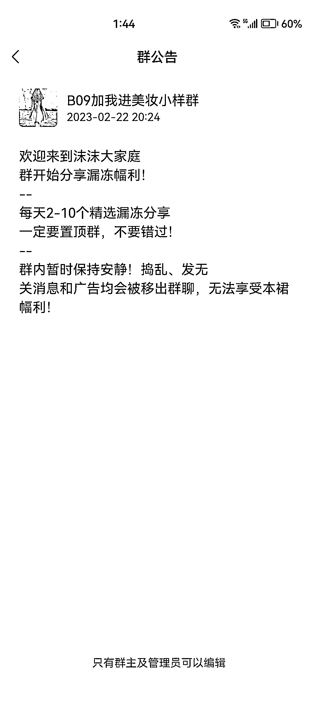
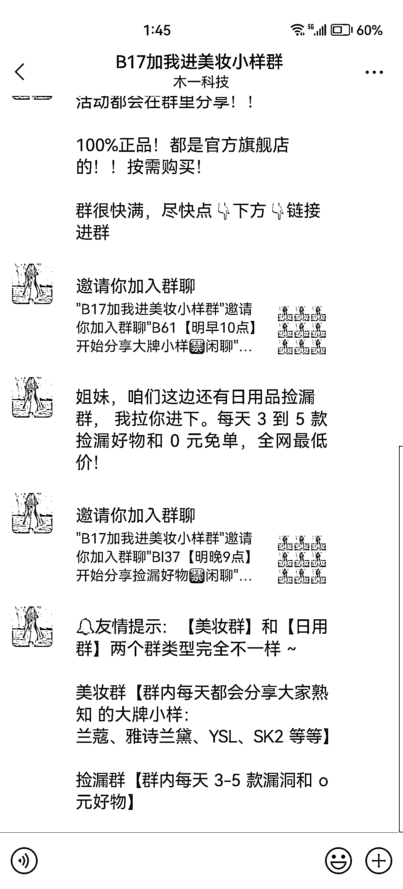
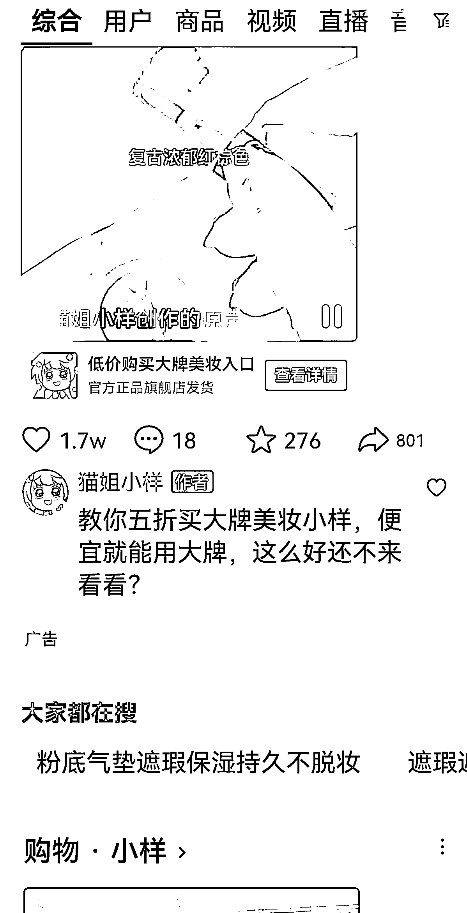

# 抖音投放广告引私域，小程序和公众号过度，直接加到企业微信

> 原文：[`www.yuque.com/for_lazy/xkrm14/vsez7aaiwqlzvn6f`](https://www.yuque.com/for_lazy/xkrm14/vsez7aaiwqlzvn6f)

作者： 嘻嘻｜溪溪

日期：2023-03-24

点赞数：24

正文：

抖音投放广告引私域，小程序和公众号都是过度下，直接加到企业微信，量很大，女孩子无法拒绝。具体怎么个流程，等我明天去下个单[微笑]再来补充。引流的人到手了，只要没啥问题都会下个单，认为占了便宜，只要是用的感觉不错，复购率不会低，而我记得很多大牌的小样都是赠品，不要钱的[呲牙]这种渠道是真的利润不低

评论区：

阿辉|solas : 这个确实猛，也有直接在朋友圈投放的，进群速度非常快

嘻嘻｜溪溪 : 护肤品还是消耗品，最后买的也不会少，流量特别大

柠檬 兰子 : 我刚进了几个群，也有 0 撸的，就是一两包纸巾，化妆品都是说得比较厉害，高大上，便宜几百的，其实和拼上面价格差不多。但是确实人非常多

嘻嘻｜溪溪 : 大牌化妆品小样是不错，渠道好的话很可以

公众号懒人找资源，懒人专属群分享

