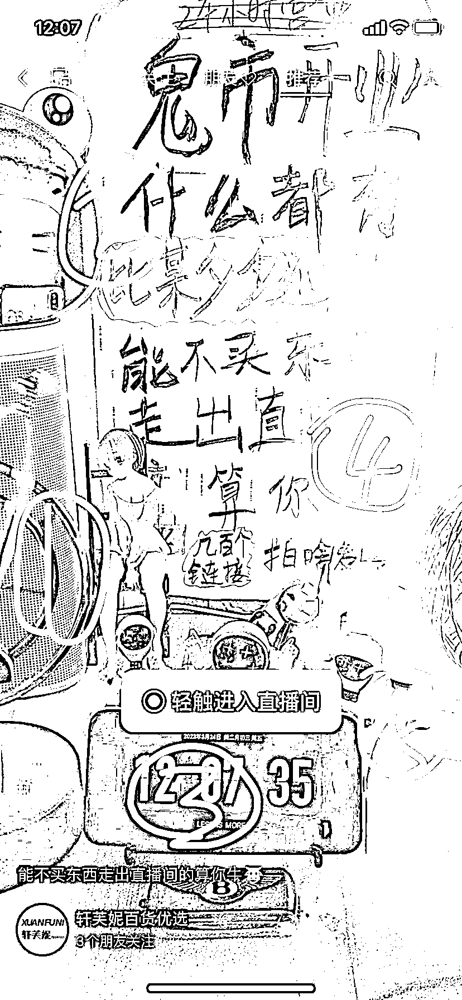

# 抖音半无人直播卖货账号拆解

> 原文：[`www.yuque.com/for_lazy/xkrm14/ganvvshge29b8bty`](https://www.yuque.com/for_lazy/xkrm14/ganvvshge29b8bty)

<ne-p id="ub6ec3e0f" data-lake-id="ub6ec3e0f"><ne-text id="u7a9c4b0e">作者： 桔子@小桔圈</ne-text></ne-p> <ne-p id="u170797bb" data-lake-id="u170797bb"><ne-text id="u78998357">日期：2023-03-24</ne-text></ne-p> <ne-p id="u1744f705" data-lake-id="u1744f705"><ne-text id="u6aea90b3">点赞数：</ne-text><ne-text id="u87bd49b4" ne-bold="true">25</ne-text></ne-p> <ne-hole id="u751dd171" data-lake-id="u751dd171"><ne-card data-card-name="hr" data-card-type="block" id="eAJmi" data-event-boundary="card"><ne-p id="u5b08ce20" data-lake-id="u5b08ce20"><ne-text id="uce1ef2d3">正文：</ne-text></ne-p> <ne-p id="u16e6f8d6" data-lake-id="u16e6f8d6"><ne-text id="ua9c05f47">同行是最好的老师，我一直说。看到个直播间，简单拆解 这是个半无人直播卖货， 1.会不停地动 2.镜子返照主播的脸 在动 3.时间在动 4.闪光灯在动</ne-text> <ne-text id="u602b746f">5.加湿器在动 主播还会吧手机拿出来在镜头下看，女玩偶引起用户好奇 会评论，主播回去拿玩偶展示。 嗯 这就是半无人直播的核心点呗</ne-text> <ne-text id="u51787437">同行都给你演示的明明白白，只要是明面上的，想学习模仿确实挺容易。</ne-text></ne-p> <ne-p id="u3fb3d2b5" data-lake-id="u3fb3d2b5"><ne-card data-card-name="image" data-card-type="inline" id="VbQZ0" data-event-boundary="card"></ne-card></ne-p> <ne-hole id="ua06318dc" data-lake-id="ua06318dc"><ne-card data-card-name="hr" data-card-type="block" id="LSiSN" data-event-boundary="card"><ne-p id="uacb79d73" data-lake-id="uacb79d73"><ne-text id="uc333ab3b">评论区：</ne-text></ne-p> <ne-p id="uf5b1d249" data-lake-id="uf5b1d249"><ne-text id="u15d976bb">安哥拉 : 这是在抖音这样播吗？</ne-text></ne-p> <ne-p id="u9c1662ac" data-lake-id="u9c1662ac"><ne-text id="u45079c8e">桔子@小桔圈 : 视频号看到的</ne-text></ne-p> <ne-hole id="u9ddf8759" data-lake-id="u9ddf8759"><ne-card data-card-name="hr" data-card-type="block" id="TG8zv" data-event-boundary="card"><ne-p id="u8f771118" data-lake-id="u8f771118"><ne-text id="uf9cab479">公众号懒人找资源，懒人专属群分享</ne-text></ne-p></ne-card></ne-hole></ne-card></ne-hole></ne-card></ne-hole>