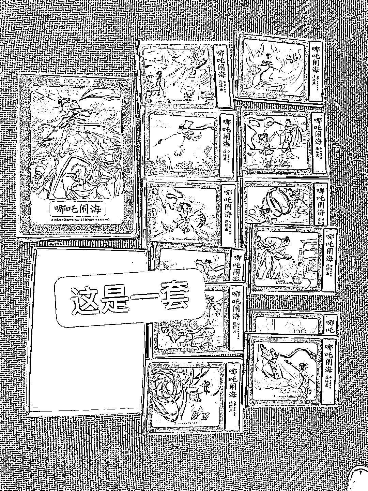
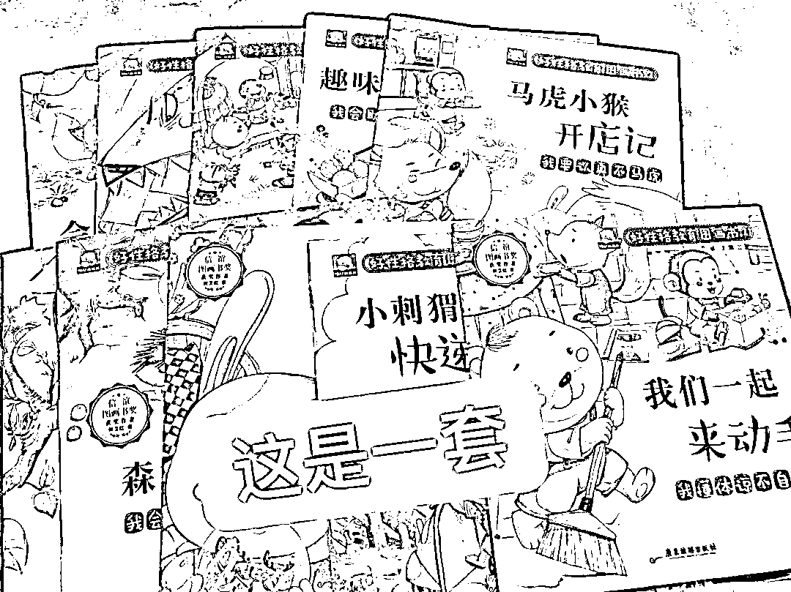
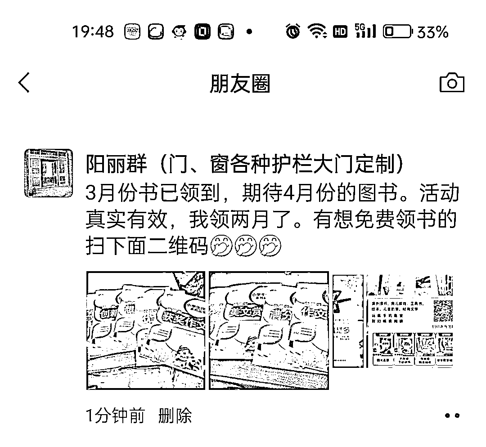
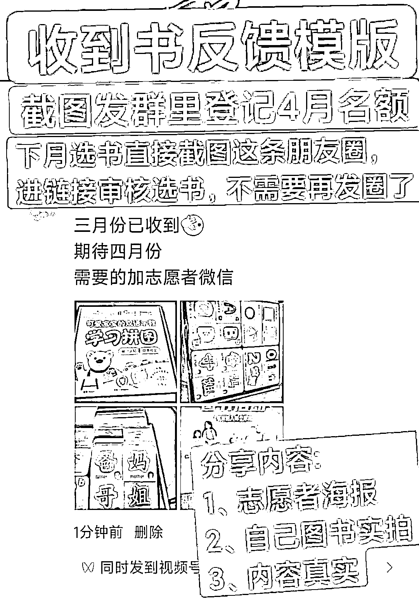

# 以公益赠书为名，朋友圈可以裂变，适合有宝妈资源的

> 原文：[`www.yuque.com/for_lazy/xkrm14/wlz993zgac2oabrc`](https://www.yuque.com/for_lazy/xkrm14/wlz993zgac2oabrc)

作者： 田春先

日期：2023-03-31

点赞数：47

正文：

以公益赠书为名，15 元邮费任选，之前小红书有大佬分享过图书供应链资源，朋友圈可以裂变，适合有宝妈资源的。

  

  

  

  

  

  

  

  

  

评论区：

西琪💫 : 朋友圈看到过，不知道咋挣钱的

岛民吴同学 : 这些图书都很便宜，拼夕夕上根本不到 15 元，邮费 15 都存在赚钱了

momo : 刚做完一期，引流是很不错的，但，如果书的品质不好，对于想要做私域的人来说，不太能持续

Jeffrey : 偶尔搞一次还行，书的品质不怎么好，吸引来的都是贪便宜低客单价的群体

公众号懒人找资源，懒人专属群分享

</ne-p></ne-p></ne-p></ne-p></ne-p></ne-p></ne-p></ne-p></ne-p>