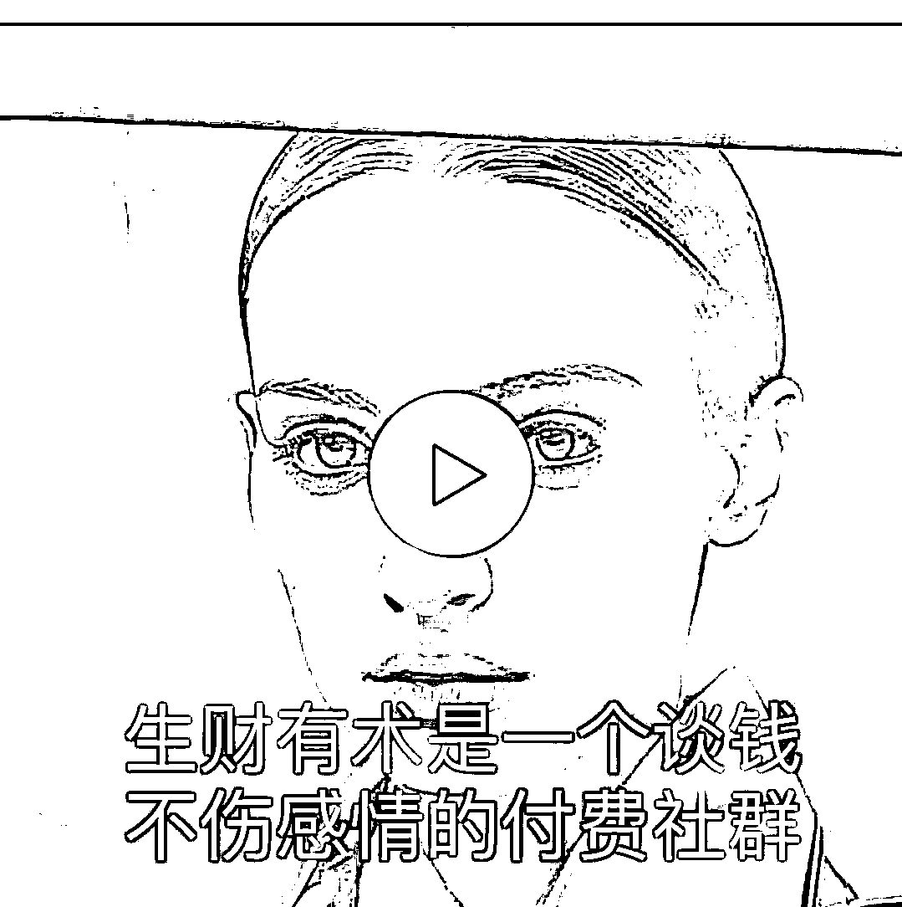

# 工具分享：利用腾讯智影+文本，生成视频

> 原文：[`www.yuque.com/for_lazy/xkrm14/loqfhi555rs4ke1a`](https://www.yuque.com/for_lazy/xkrm14/loqfhi555rs4ke1a)

作者： Sunwei

日期：2023-03-31

点赞数：39

<ne-hole id="u57984345" data-lake-id="u57984345"><ne-card data-card-name="hr" data-card-type="block" id="pk4bQ" data-event-boundary="card">

正文：

腾讯智影/人像照片播报体验，给出一张闭嘴人像照片+自定义文本，输出视频，但型不太对口…总感觉差点意思，毕竟才给了一张图，面部表情会很生硬。 [腾讯智影/人像照片播报体验，型不对口～+-+即刻 App](https://m.okjike.com/originalPosts/64261969f6f3489ef7eb94d6?s=ewoidSI6ICI1NzlkZTBiOTAxYTE1ZTEyMDBlZWFlMTgiCn0=)

<ne-card data-card-name="image" data-card-type="inline" id="OYQcD" data-event-boundary="card">  <ne-hole id="u18f5ca57" data-lake-id="u18f5ca57"><ne-card data-card-name="hr" data-card-type="block" id="PNFXc" data-event-boundary="card"><ne-p id="u702bb542" data-lake-id="u702bb542">评论区：

城市隐者 : 软件就叫腾讯智影？

Sunwei : 小程序，这是昨天大新闻，腾讯的 AIGC 入场综合工具。

城市隐者 : 真是风向标

微观保险 : 自定义需要¥3999/年

bgz 洲洲 : 做出来只有嘴在动，面部表情都不动

Sunwei : 毕竟只用了一张图

Sunwei : 不算贵，市场价大约 5000 左右

juice : 中午体验了一下，确实口型跟文字对不上

<ne-hole id="ue4d28d66" data-lake-id="ue4d28d66"><ne-card data-card-name="hr" data-card-type="block" id="Oittq" data-event-boundary="card">

公众号懒人找资源，懒人专属群分享

</ne-card></ne-hole></ne-card></ne-hole></ne-card></ne-p></ne-card></ne-hole>