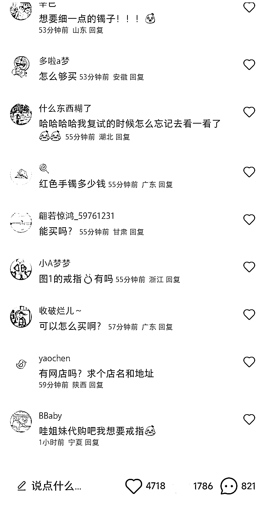

# 利用高校特色售卖相关产品，自带信任感

> 原文：[`www.yuque.com/for_lazy/xkrm14/vdr358cv312irasf`](https://www.yuque.com/for_lazy/xkrm14/vdr358cv312irasf)

作者： Jay

日期：2023-03-30

点赞数：23

<ne-card data-card-name="hr" data-card-type="block" id="gWEOi" data-event-boundary="card">

正文：

中国地质大学校内珠宝小店，博主是在校生，评论区八百多条都是要买要代购的，两篇笔记粉丝已经一千多了 高校有特色产品资源的，可以开发一下，高校产品信任感更强

<ne-card data-card-name="image" data-card-type="inline" id="u91TE" data-event-boundary="card">  <ne-p id="u3c2ac04d" data-lake-id="u3c2ac04d"><ne-card data-card-name="image" data-card-type="inline" id="E48Td" data-event-boundary="card">  <ne-card data-card-name="hr" data-card-type="block" id="OEOD9" data-event-boundary="card"><ne-p id="uaec15117" data-lake-id="uaec15117">评论区：

Jay : 谢谢老大！

<ne-card data-card-name="hr" data-card-type="block" id="elcYm" data-event-boundary="card">

公众号懒人找资源，懒人专属群分享

</ne-card></ne-card></ne-card></ne-p></ne-card></ne-p></ne-card>