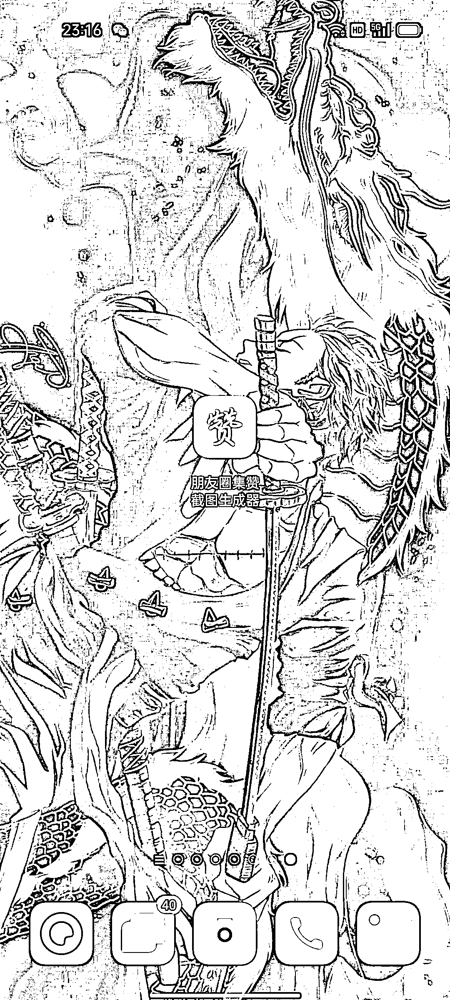
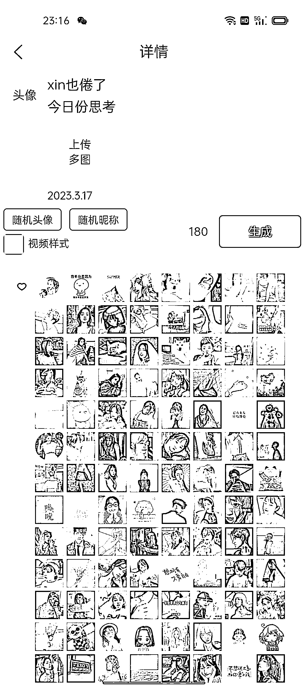
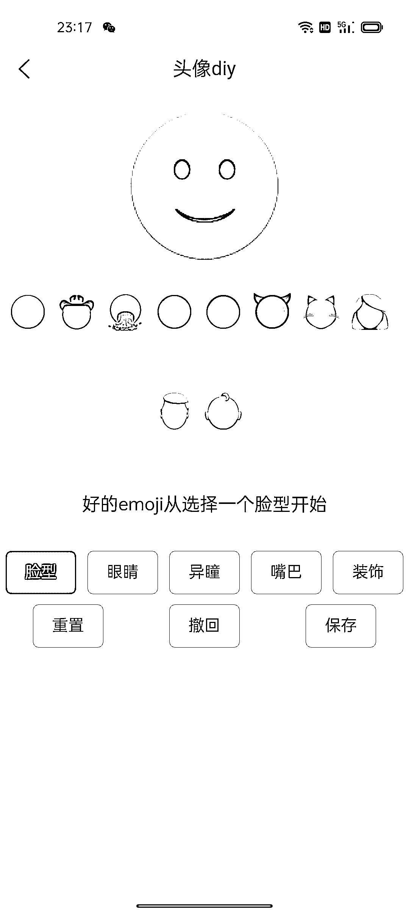
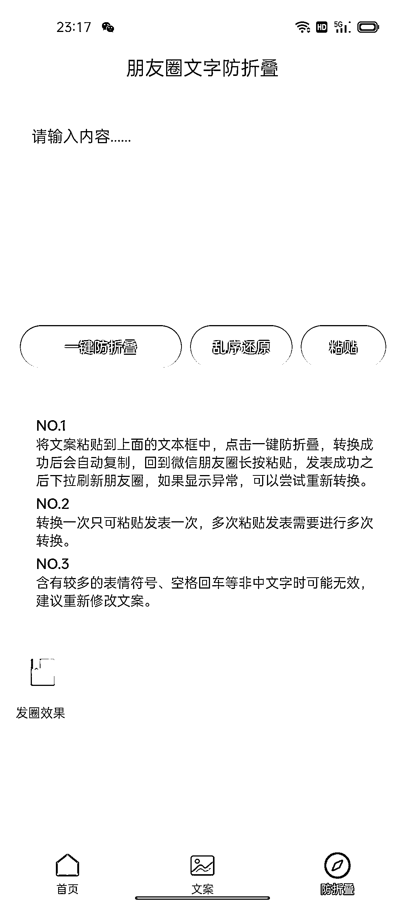

# 工具推荐：朋友圈集赞生成器

> 原文：[`www.yuque.com/for_lazy/xkrm14/xxg1krxzsyak4coe`](https://www.yuque.com/for_lazy/xkrm14/xxg1krxzsyak4coe)

作者： 明月几时有

日期：2023-03-28

点赞数：61

<ne-card data-card-name="hr" data-card-type="block" id="Nms2w" data-event-boundary="card">

正文：

分享一个刚发现的发微信 APP 朋友圈集赞可以直接生成，头像文案都自己改，用来发小红书引流不错。看图三 里面各种类型的头像，再也不用到处找头像了，看图四 可以生成自己喜欢的 DIY 表情包。看图五 直接生成励志文案也可以用来发小红书引流。看图七 还有一个发朋友圈防折叠功能 目前免费，它的盈利模式是各种广告。

<ne-card data-card-name="image" data-card-type="inline" id="PuppR" data-event-boundary="card"></ne-card>

<ne-card data-card-name="image" data-card-type="inline" id="wCKv5" data-event-boundary="card"></ne-card>

<ne-card data-card-name="image" data-card-type="inline" id="n59E6" data-event-boundary="card"></ne-card>

<ne-card data-card-name="image" data-card-type="inline" id="qqxZ2" data-event-boundary="card"></ne-card>

<ne-card data-card-name="image" data-card-type="inline" id="iP3jy" data-event-boundary="card"></ne-card>

<ne-card data-card-name="image" data-card-type="inline" id="tvgok" data-event-boundary="card"></ne-card>

<ne-card data-card-name="image" data-card-type="inline" id="D03mB" data-event-boundary="card"></ne-card>

<ne-card data-card-name="image" data-card-type="inline" id="ZIlj0" data-event-boundary="card"></ne-card>

<ne-card data-card-name="hr" data-card-type="block" id="dWxOg" data-event-boundary="card">

评论区：

微信用户 : 有下载链接吗？应用市场搜索不到

大星儿 : IOS 系统应该有，我安卓也没找到，在浏览器找不是同款 App

艾风 : 微信搜索名字，在小程序可以找到 app

大星儿 : 微信小程序搜索：朋友圈集赞截图生成器嘛，试了下也没有

艾风 : 我发个风向标，你参考下

明月几时有 : 微信公众号搜索一下，我是微信公众号下载的，或者浏览器搜索

<ne-card data-card-name="hr" data-card-type="block" id="Kohug" data-event-boundary="card">

公众号懒人找资源，懒人专属群分享

</ne-card></ne-card></ne-card>